# VeraGrid dynamic tool practical session - EMT modelling

**Creating an EMT model using VeraGrid**  
**Date:** 28-05-2026

## Contents

1. [VeraGrid](#1-veragrid)
   1. [VeraGrid dynamic tool](#11-veragrid-dynamic-tool)
2. [Objectives of the session](#2-objectives-of-the-session)
3. [System model](#3-system-model)
   1. [Modelling conventions and per-unit bases](#31-modelling-conventions-and-per-unit-bases)
4. [Device parameters](#4-device-parameters)
   1. [Static network creation and simulation settings](#41-static-network-creation-and-simulation-settings)
   2. [Static model assignment](#42-static-model-assignment)
   3. [Dynamic model assignment](#43-dynamic-model-assignment)
   4. [EMT events](#44-emt-events)
5. [EMT model construction](#5-emt-model-construction)
   1. [Static model construction](#51-static-model-construction)
   2. [Dynamic model construction](#52-dynamic-model-construction)
   3. [Events](#53-events)
6. [Simulation and post-processing](#6-simulation-and-post-processing)
   1. [Simulation](#61-simulation)
   2. [Dynamic results](#62-dynamic-results)
7. [Suggestions](#7-suggestions)

---

## 1. VeraGrid

VeraGrid is an open-source power-system modelling and simulation platform used to build, store, analyse and visualise electrical networks. It combines a graphical user interface with a calculation engine, so the same network model can be used for steady-state studies, grid validation and dynamic studies.

In this practical session, VeraGrid is used as the environment where one can create the network, assign device parameters and launch the EMT simulation.

### 1.1. VeraGrid dynamic tool

The VeraGrid dynamic tool is used to study the time-domain response of the network after changes such as faults, set-point changes or controller actions. In this session, it is used in EMT mode, where each device is represented through dynamic blocks, variables, parameters and equations.

## 2. Objectives of the session

The objective of this practical session is to create a two-bus system in VeraGrid using EMT models. The session combines static network definition, dynamic model assignment, event configuration and post-processing of simulation results.

At the end of the session, students should be able to:

- Create a small network in VeraGrid.
- Assign EMT dynamic templates.
- Configure step and ramp events that modify simulation parameters.
- Run an EMT simulation and identify the expected response.

## 3. System model

The system represents a two-bus system with a generator connected to a load by means of a line.

### 3.1. Modelling conventions and per-unit bases

| Quantity | Value | Comment |
|---|---:|---|
| System base power, `Sbase` | 100 MVA | Common base for the exercise |
| Nominal frequency, `f` | 50 Hz | Used for `omega_base = 2*pi*f` |
| AC nominal voltage | 10 kV | Buses 0 and 1 |

## 4. Device parameters

### 4.1. Static network creation and simulation settings

#### 4.1.1. Grid and bus data

| Object | Parameter | Value |
|---|---|---:|
| Grid | `Sbase` | 100 MVA |
| Grid | `freq` | 50 Hz |
| Bus 0 | `is_dc` | `False` |
| Bus 0 | `is_slack` | `True` |
| Bus 0 | `Vnom` | 10 kV |
| Bus 1 | `is_dc` | `False` |
| Bus 1 | `is_slack` | `False` |
| Bus 1 | `Vnom` | 10 kV |

#### 4.1.2. Simulation settings

| Parameter | Value |
|---|---|
| Integration | `DAE_Trapezoidal` |
| Initialisation | `Explicit` |
| Solver | `Structural Compiled` |
| Tolerance | `1e-4` |
| Simulation time | `0.06` |
| Time step | `1e-6` |

### 4.2. Static model assignment

#### 4.2.1. Generator static data

| Device | Parameter | Value |
|---|---|---:|
| Generator 1 | `Vset` | 1.0 p.u. |
| Generator 1 | `Snom` | 100 MVA |
| Generator 1 | `r1` | 0.001 |
| Generator 1 | `x1` | 1.7 |

#### 4.2.2. Load static data

| Device | Parameter | Value |
|---|---|---:|
| Load | `P` | 1 MVA |
| Load | `Pa` | 0.33333 MVA |
| Load | `Pb` | 0.33333 MVA |
| Load | `Pc` | 0.33333 MVA |
| Load | `Q` | 0.0 MVA |
| Load | `Qa` | 0.0 MVA |
| Load | `Qb` | 0.0 MVA |
| Load | `Qc` | 0.0 MVA |
| Load | `conn` | `Y` |

#### 4.2.3. Line static data: tower template

| Device | Parameter | Value |
|---|---|---|
| Tower | Voltage | 10 kV |
| Tower | Wire | `-_ACSR_0.902` |

**Wire composition**

| X (m) | Y (m) | Phase |
|---:|---:|---:|
| -12 | 27 | 1 |
| 0 | 27 | 2 |
| 12 | 27 | 3 |

> How to create towers is explained in [Section 5.1](#51-static-model-construction).

### 4.3. Dynamic model assignment

#### 4.3.1. Generator dynamic model

Use the **complete generator EMT template**, or create the generator by connecting the generator, exciter, governor and stabiliser blocks.

The generator has many different models. The recommendation is to build the generator using the generator, exciter, governor and stabiliser blocks in the library and connect them in the dynamic editor.

However, there is a faster way of creating the generator block: add the complete generator template from the catalogue and use it. The process to add the catalogue is explained in [Section 5.1](#51-static-model-construction).

#### 4.3.2. Line dynamic model

Generally, the **EMT Pi line** template is used. However, to see real wave transmission across the lines, the **Bergeron line model** is preferred.

#### 4.3.3. Load dynamic model

To keep the exercise simple, the **R load** is selected. The configuration must be selected from the static object.

### 4.4. EMT events

| Event | Device | Time interval (s) | Parameter | New value | Transition |
|---|---|---:|---|---:|---|
| Decrease load | Load | 0.02 | `R_A` | 200 | Step |
| Decrease load | Load | 0.02 | `R_B` | 200 | Step |
| Decrease load | Load | 0.02 | `R_C` | 200 | Step |
| Increase load | Load | 0.04-0.05 | `R_A` | 300 | Ramp |
| Increase load | Load | 0.04-0.05 | `R_B` | 300 | Ramp |
| Increase load | Load | 0.04-0.05 | `R_C` | 300 | Ramp |

## 5. EMT model construction

### 5.1. Static model construction

This is the built model:

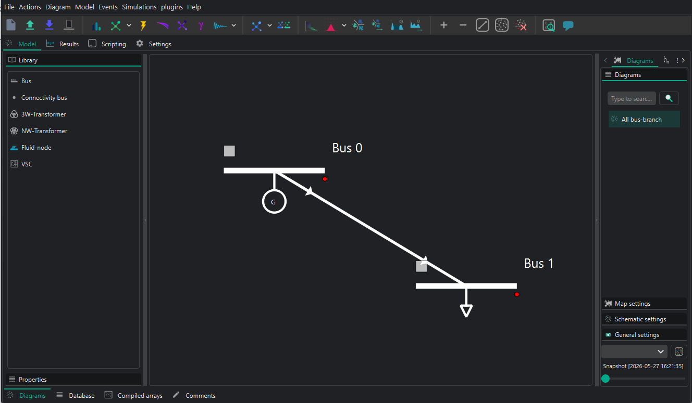

1. Add buses by dragging a bus from the **Library** in the left vertical bar to the centre of the diagram.
2. Add injections, such as generators, by right-clicking on the bus.

   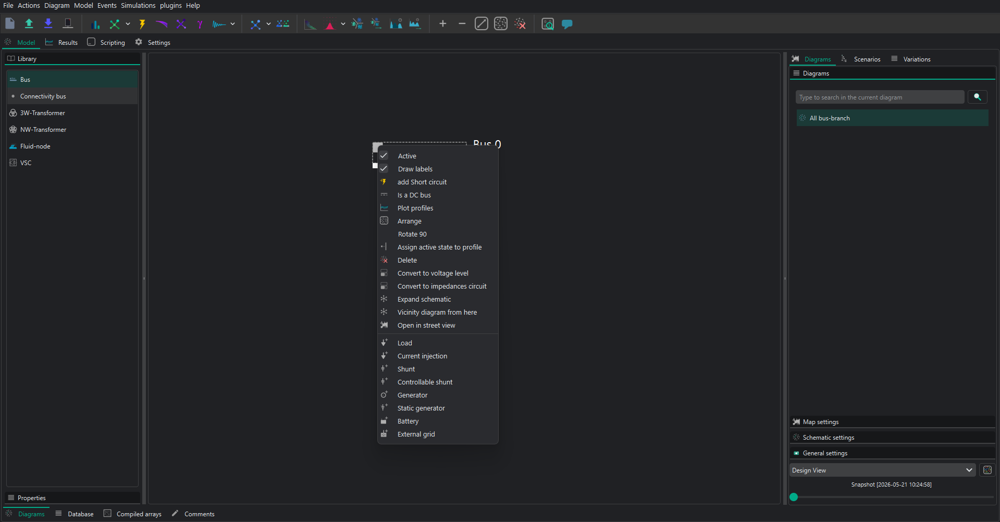

3. To add VSC or DC lines, first configure the DC buses as DC buses. To change the properties of a device or bus, use the left vertical bar and go to **Properties**. Set the DC buses as `is_dc = True`. Take this opportunity to change all parameters in all buses. See the parameter values in [Section 4](#4-device-parameters). After that, drag a line connecting the buses to create the VSC devices between the AC and DC buses and the DC line between the DC buses.
4. Add all static parameters in the left vertical bar for all devices. See the parameter values in [Section 4](#4-device-parameters).
5. To build lines, there are two options:
   - Complete the `R`, `X` and `B` properties of the line object directly in the diagram. These are balanced values.
   - Build a tower configuration to add line parameters from a tower and represent unbalanced lines.

   To build a tower configuration:

   1. Add the towers and wires in the catalogue. Go to **Actions -> Add default catalogue** and select the required templates. RMS and EMT templates can also be added and used from this menu.

      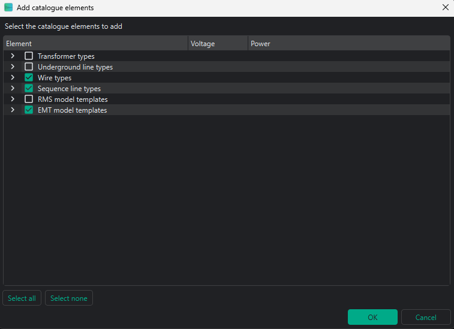

   2. Go to **Database -> Catalogue -> Towers**. Add a new tower by clicking the `+` button, or right-click and edit an existing tower. The tower editor will open. Select the required wire, add the wire positions and phases, and set the voltage of the line.

      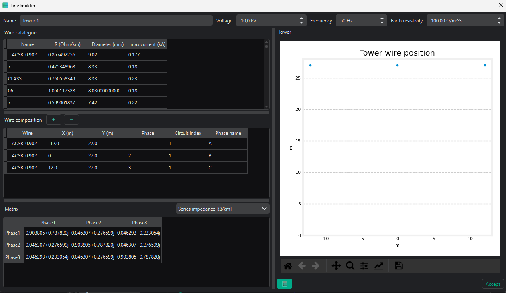

   3. Return to the main diagram and double-click on the line. Go to **Line editor**, select the required tower template, load the template values and click **Accept**. The `R`, `X`, `B` and rate values of the line will be updated in the line properties.

      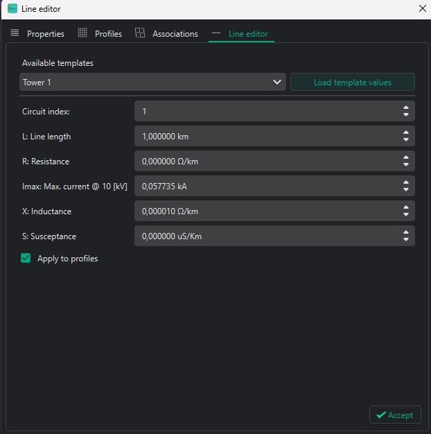

6. To check whether the static model is correct, run a power flow by clicking the power-flow icon in the upper bar. The result should be similar to the following:

   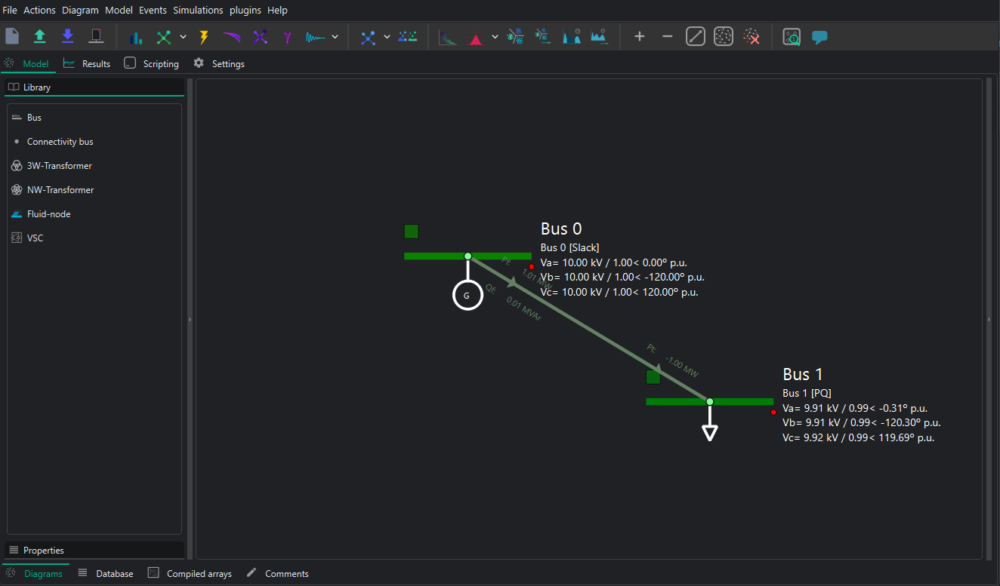

### 5.2. Dynamic model construction

VeraGrid allows two different dynamic simulation modes: **RMS** and **EMT**. The following explanation works for both simulation types.

There are two ways to assign dynamic models to a device:

1. Assign an `rms_template` or `emt_template` from the **Properties** left vertical bar. This method does not currently allow the dynamic parameters to be edited, so it is not recommended when the controls and dynamic parameters must be correctly parametrised.

   To use this option, the default EMT/RMS catalogue must be added from **Actions -> Add default catalogue**. Select the templates to be added. The added templates can be seen in **Database -> Templates -> RMS/EMT Template**.

2. Open the **RMS/EMT editor** and create the model there. This is the option used in this practice.

To open the RMS/EMT editor, right-click on the device to be edited and select the editor to be used. In this case, select the **EMT editor**.

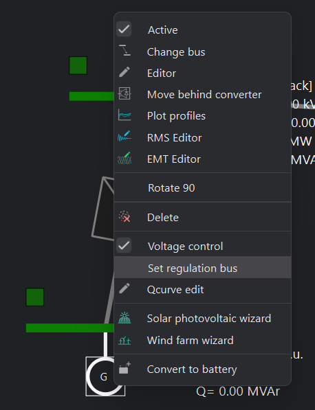

For example, for the generator:

The dynamic editor is divided into two main parts:

- The main page, where the model is created by blocks.
- The left bar, which contains the library of available blocks and devices.

When opening the EMT editor, some blocks are already in the main page. These are the grid connection blocks. To dynamically connect devices, the simulator needs the voltages and currents of the device. These blocks must be connected to the device to be created.

For AC variables, the three phases plus the neutral appear. Add devices by dragging them from the library into the main page.

To inspect a model, select it and then use the left vertical bar:

- **Variables:** all variables of the block are classified here. Their initial value or initial equation can be seen and edited if needed.
- **Parameters:** all parameters of the block are classified here. Their values can be changed to fit the required model. These parameters can be tuned to the user's needs.
- **Equations:** all state and algebraic equations of the block can be seen and edited if needed.

This is the final model for the generator when selecting the Thevenin equivalent generator, for example:

The following is an example of building a generator with all its controllers:

In both cases, the neutral wire connections are not used. Leave them as they are; the solver will understand that there is no neutral wire for this model.

### 5.3. Events

Adding events to the dynamic simulations is the way to test different grid scenarios. In this case, the system will be energised and de-energised.

In VeraGrid, there are two objects to consider when adding events:

- **RMS/EMT Events Group:** this is the simulation where events are applied. Each event group is a different simulation. All created event groups can be seen and edited in **Database -> Dynamic -> RMS/EMT Events Group**. This is useful to perform different simulations for the same grid, such as one with a short-circuit event and another with a fault.
- **RMS/EMT Events:** this defines exactly what happens to a parameter. The user must select the parameter where the event is applied, its new value and the event time. There are two types of events available: **Steps** and **Ramps**. All created events can be seen and edited in **Database -> Dynamic -> RMS/EMT Event**.

To add an event from the static model, click on the device where the event is configured and go to **Events -> Add EMT event to selected**. If there is no `EmtEventsGroup`, it must be created.

Create the `EmtEventsGroup` by giving it a name, for example `simulation1`.

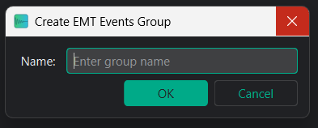

After that, add the new events and parametrise them according to [Section 4.4](#44-emt-events). These are, for example, some possible events to change the reference power of a VSC:

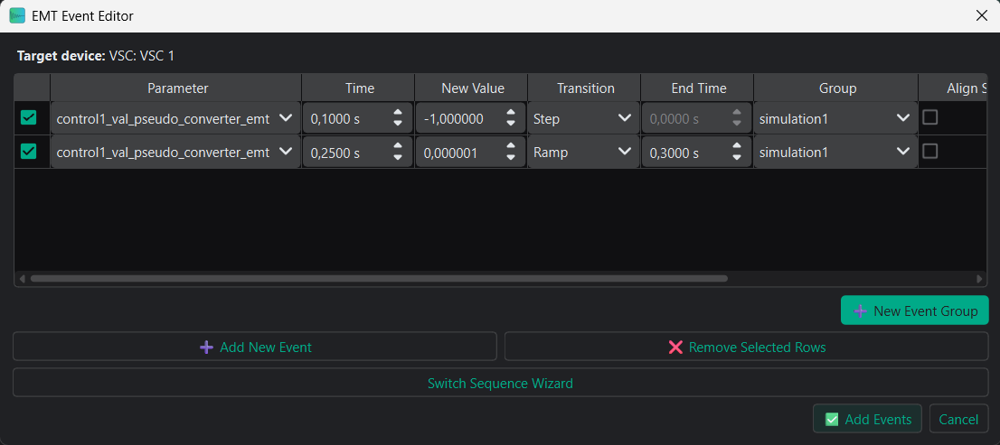

The RMS/EMT `EventsGroup` and RMS/EMT events can be seen and edited from **Database -> Dynamics**.

## 6. Simulation and post-processing

### 6.1. Simulation

To perform an EMT simulation, click the dynamic simulation button in the upper bar. The simulation will last a few seconds.

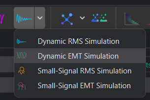

### 6.2. Dynamic results

To see the results, go to **Results -> EMT Dynamic**. There are two main parts:

- **Dynamic results:** this section contains all variables available to be plotted. By double-clicking on a variable, the plot appears.
- **Dynamic plots:** this section is used to create plots with more than one variable. Dynamic plots are added by clicking on the `+` sign in the upper-right corner. Variables from the dynamic results can be dragged to the plots and then plotted by double-clicking the plot.

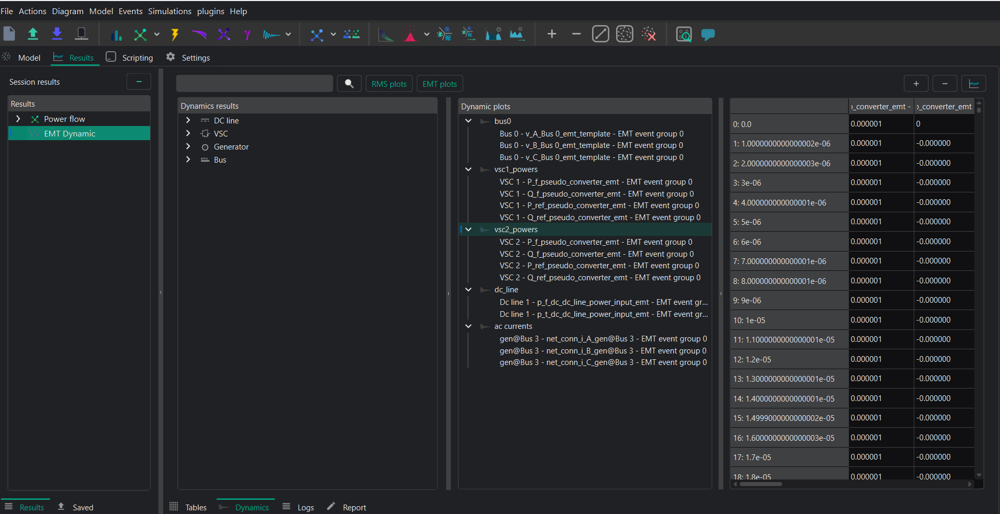

## 7. Suggestions

The eRoots dynamic team is very happy to hear your suggestions. Do not hesitate to share anything you think can be improved.
