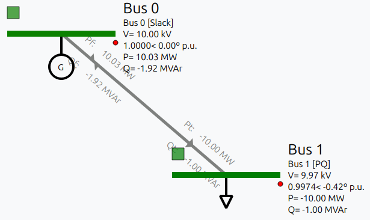
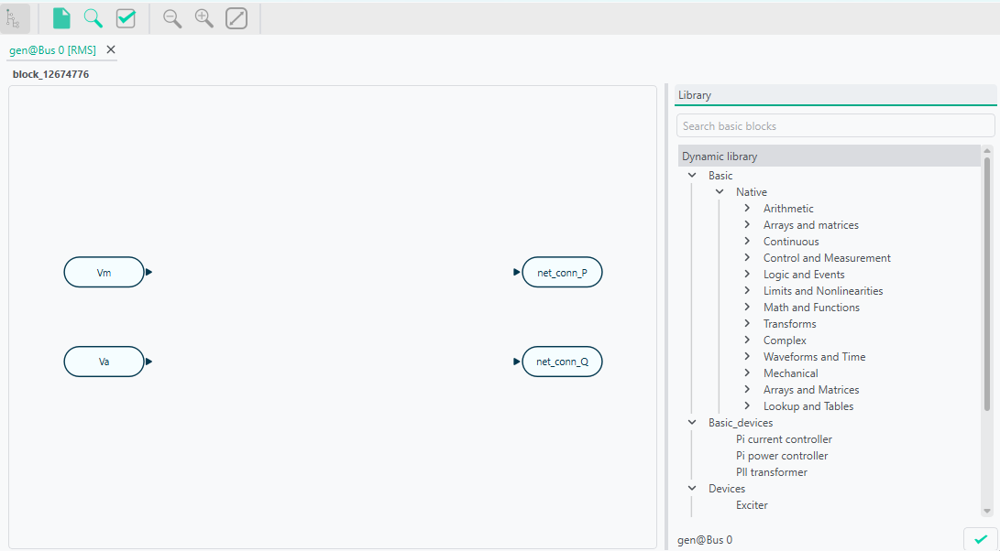
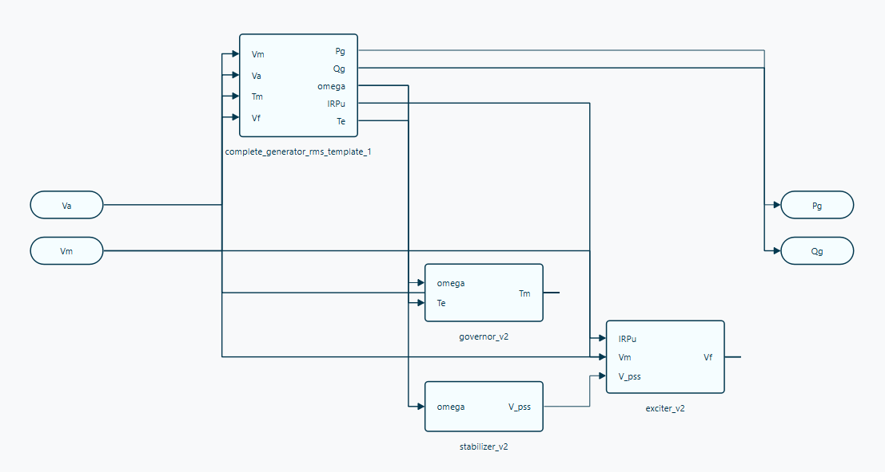

# Dynamic tool practical session: Creating an RMS model using VeraGrid

**Date:** 28-05-2026

## Guide contents

1. [VeraGrid](#1-veragrid)
   1. [VeraGrid dynamic tool](#11-veragrid-dynamic-tool)
2. [Objectives of the session](#2-objectives-of-the-session)
3. [System model](#3-system-model)
   1. [Modelling conventions and per-unit bases](#31-modelling-conventions-and-per-unit-bases)
4. [Device parameters](#4-device-parameters)
   1. [Static network creation and simulation settings](#41-static-network-creation-and-simulation-settings)
   2. [Static model assignment](#42-static-model-assignment)
   3. [Dynamic model assignment](#43-dynamic-model-assignment)
   4. [RMS events](#44-rms-events)
5. [RMS model construction](#5-rms-model-construction)
   1. [Static model construction](#51-static-model-construction)
   2. [Dynamic model construction](#52-dynamic-model-construction)
   3. [Events](#53-events)
6. [Simulation and post-processing](#6-simulation-and-post-processing)
   1. [Simulation](#61-simulation)
   2. [Dynamic results](#62-dynamic-results)
7. [Suggestions](#7-suggestions)

---

## 1. VeraGrid

VeraGrid is an open-source power-system modelling and simulation platform used to build, store, analyse and visualise electrical networks. It combines a graphical user interface with a calculation engine, so the same network model can be used for steady-state studies, grid validation and dynamic studies.

In this practical session, VeraGrid is used as the environment where one can create the network, assign device parameters and launch the RMS simulation.

### 1.1. VeraGrid dynamic tool

The VeraGrid dynamic tool is used to study the time-domain response of the network after changes such as faults, set-point changes or controller actions. In this session, it is used in RMS mode, where each device is represented through dynamic blocks, variables, parameters and equations.

## 2. Objectives of the session

The objective of this practical session is to create a 2-bus system in VeraGrid using RMS models. The session combines static network definition, dynamic model assignment and construction, event configuration and post-processing of simulation results.

At the end of the session, students should be able to:

- Create a small network in VeraGrid.
- Assign RMS dynamic templates.
- Build models in the block editor.
- Configure step and ramp events that modify parameters of the simulation.
- Run an RMS simulation and identify the expected response.

## 3. System model

The system represents a two-bus system with a generator connected to a load by means of a line.

### 3.1. Modelling conventions and per-unit bases

| Quantity | Value | Comment |
|---|---:|---|
| System base power, `Sbase` | 100 MVA | Common base for the exercise |
| Nominal frequency, `f` | 50 Hz | Used for `omega_base = 2*pi*f` |
| AC nominal voltage | 10 kV | Buses 0 and 1 |

## 4. Device parameters

### 4.1. Static network creation and simulation settings

#### 4.1.1. Grid and bus data

| Object | Parameter | Value |
|---|---|---:|
| Grid | `Sbase` | 100 MVA |
| Grid | `freq` | 50 Hz |
| Bus 0 | `Is_dc` | False |
| Bus 0 | `Is_slack` | True |
| Bus 0 | `Vnom` | 10 kV |
| Bus 1 | `Is_dc` | False |
| Bus 1 | `Is_slack` | False |
| Bus 1 | `Vnom` | 10 kV |

#### 4.1.2. Simulation settings

| Parameter | Value |
|---|---:|
| Integration | `DAE_BackEuler` |
| Initialization | Explicit |
| Tolerance | `1e-4` |
| Simulation time | 1 s |
| Time step | `1e-3` |

### 4.2. Static model assignment

#### 4.2.1. Generator static data

| Device | Parameter | Value |
|---|---|---:|
| Generator 1 | `Vset` | 1.0 p.u. |
| Generator 1 | `Snom` | 900 MVA |
| Generator 1 | `freq` | 50 Hz |
| Generator 1 | `r1` | 0.3 |
| Generator 1 | `x1` | 0.86 |

#### 4.2.2. Load static data

| Device | Parameter | Value |
|---|---|---:|
| Load 1 | `P` | 9.999999 MVA |
| Load 1 | `Q` | 0.999999 MVA |

#### 4.2.3. Line static data

| Device | Parameter | Value |
|---|---|---:|
| Line 1 | `R` | 0.029585 p.u. |
| Line 1 | `X` | 0.071005 p.u. |
| Line 1 | `B` | 0.03 p.u. |
| Line 1 | `rate` | 900 MVA |

### 4.3. Dynamic model assignment

#### 4.3.1. Generator dynamic model: complete generator RMS template

| Device | Component | Parameter | Value |
|---|---|---|---:|
| Generator 1 | Exciter | `AEz` | 0.02 |
| Generator 1 | Exciter | `BEz` | 1.50 |
| Generator 1 | Exciter | `Se_threshold` | 1.0 |
| Generator 1 | Exciter | `EfeMaxPu` | 15.0 |
| Generator 1 | Exciter | `EfeMinPu` | -5.0 |
| Generator 1 | Exciter | `TolLi` | 0.05 |
| Generator 1 | Exciter | `VaMaxPu` | 2.5 |
| Generator 1 | Exciter | `VaMinPu` | -2.0 |
| Generator 1 | Exciter | `VeMinPu` | -2.0 |
| Generator 1 | Exciter | `VfeMaxPu` | 5 |
| Generator 1 | Exciter | `AEx` | 0.02 |
| Generator 1 | Exciter | `BEx` | 0.01 |
| Generator 1 | Exciter | `ToLLi` | 0.05 |
| Generator 1 | Exciter | `VeMinPu_submodel` | -5.1 |
| Generator 1 | Exciter | `VfeMaxPu_submodel` | 5 |
| Generator 1 | Stabilizer | `Ks` | 20 |
| Generator 1 | Stabilizer | `VPssMinPu` | 1 |
| Generator 1 | Stabilizer | `VPssMinPu` | -1 |
| Generator 1 | Stabilizer | `SNom` | 1 |
| Generator 1 | GenQec | `fn` | 50 |
| Generator 1 | GenQec | `ws` | 314.159 |
| Generator 1 | GenQec | `M` | 3.5 |
| Generator 1 | GenQec | `D` | 10 |
| Generator 1 | GenQec | `Rs` | 0.003 |
| Generator 1 | GenQec | `Ra` | 0.003 |
| Generator 1 | GenQec | `Xd` | 1.8 |
| Generator 1 | GenQec | `Xq` | 1.7 |
| Generator 1 | GenQec | `Xd_prime` | 0.3 |
| Generator 1 | GenQec | `Xq_prime` | 0.55 |
| Generator 1 | GenQec | `Xd_2prime` | 0.25 |
| Generator 1 | GenQec | `Xq_2prime` | 0.35 |
| Generator 1 | GenQec | `Xl` | 0.15 |
| Generator 1 | GenQec | `Td0_prime` | 8 |
| Generator 1 | GenQec | `Tq0_prime` | 0.4 |
| Generator 1 | GenQec | `Td0_2prime` | 0.03 |
| Generator 1 | GenQec | `Tq0_2prime` | 0.05 |
| Generator 1 | GenQec | `Xd_prime_minus_Xl` |  |
| Generator 1 | GenQec | `Xq_prime_minus_Xl` |  |
| Generator 1 | GenQec | `Xdaux` |  |
| Generator 1 | GenQec | `Xdaux2` |  |
| Generator 1 | GenQec | `Xdaux3` |  |
| Generator 1 | GenQec | `Xqaux` |  |
| Generator 1 | GenQec | `Xqaux2` |  |
| Generator 1 | GenQec | `Xqaux3` |  |
| Generator 1 | GenQec | `A` | 5 |
| Generator 1 | GenQec | `B` | 1 |
| Generator 1 | Governor | `Pm_ref` |  |
| Generator 1 | Governor | `Kp` | -0.01 |
| Generator 1 | Governor | `Ki` | -0.01 |
| Generator 1 | Governor | `p0` | 1 |
| Generator 1 | Governor | `P0` | 0.01 |
| Generator 1 | Governor | `omega_ref` | 1 |
| Generator 1 | Governor | `K` | 10 |
| Generator 1 | Governor | `Pmax` | 12 |
| Generator 1 | Governor | `Pmin` | -1 |
| Generator 1 | Governor | `Uc` | -0.5 |
| Generator 1 | Governor | `Uo` | 0.5 |
| Generator 1 | Governor | `T_aux` | 0 |

#### 4.3.2. Line dynamic model: line RMS template

There are no parameters to change.

#### 4.3.3. Load dynamic model: load RMS template

There are no parameters to change.

### 4.4. RMS events

| Event | Device | Time interval | Parameter | New value | Transition |
|---|---|---:|---|---:|---|
| Decrease load | Load | 0.1 s | `Pl0` | -0.06 | Step |
| Increase load | Load | 0.2-0.3 s | `Pl0` | -0.1 | Ramp |

## 5. RMS model construction

### 5.1. Static model construction

This is the built model:

1. Buses are added by dragging a bus from the Library, located in the left vertical bar, to the centre.
2. Injections, such as generators and loads, are added by right-clicking on the bus.

3. Drag a line connecting the buses to create the line.
4. Add all static parameters in the left vertical bar for all devices. See the parameter values in [Section 4](#4-device-parameters).
5. To check if the static model is correct, run a power flow by clicking on the corresponding icon in the upper bar. The result should be the following:

### 5.2. Dynamic model construction

VeraGrid allows two different dynamic simulation modes: RMS and EMT. The following explanation works for both simulation types. There are two ways of setting dynamic models to a device:

1. Assigning a `rms_template` or `emt_template` from the Properties left vertical bar. This way, one cannot edit the dynamic parameters for now, so this mode is not recommended if one wants to correctly parametrise the controls and dynamic parameters. To do this, the default EMT/RMS catalogue must be added from **Actions -> Add default catalogue**, selecting the templates to be added. The templates can be seen in **Database -> Templates -> RMS/EMT Template**.
2. Opening the RMS/EMT editor and creating the model from there. This is the option used in this practice and explained below.

To open the RMS/EMT editor, right-click on the device to be edited and click the editor to be used. In this case, select the RMS editor.

For example, for the generator:

The dynamic editor is divided into two main parts: the main page where the model is created by blocks, and the left bar with the library of blocks and devices available.

When opening the RMS editor, some blocks are already in the main page: these are the grid connection blocks. In order to dynamically connect the devices, the simulator needs the voltages and currents of the device. These blocks must be connected to the device to be created.

Add the devices by dragging them from the library into the main page. To inspect the model, select it and then use the left vertical bar:

- **Variables:** all variables of that block are classified here. Their initial value or equation can be seen and edited if needed.
- **Parameters:** all parameters of the block are classified here. The value can be changed to fit the desired model. Here, parameters must be changed according to [Section 4](#4-device-parameters).
- **Equations:** all state and algebraic equations of the block can be seen and edited if needed.

This is the final model for the generator:

### 5.3. Events

Adding events to the dynamic simulations is the way to test different grid scenarios. In this case, the system will be energised and de-energised. In VeraGrid, there are two objects to consider when adding events:

- **RMS/EMT Events Group:** this is the simulation where events are applied. Each event group is one different simulation. One can see and edit all event groups created in **Database -> Dynamic -> Rms/Emt Events Group**. This is useful to perform different simulations on the same grid, for example one with a short-circuit event and another with a fault.
- **RMS/EMT Events:** this is what exactly happens to the parameter. One must select the parameter where the event is applied, its new value and the time of the event. There are two types of events available: steps and ramps. One can see and edit all events created in **Database -> Dynamic -> Rms/Emt Event**.

To add an event from the static model, click on the device where the event is configured and go to **Events -> Add emt event to selected**. Since there is no `EmtEventsGroup`, it must be created.

Create the `EmtEventsGroup` by giving it a name, for example `simulation1`. After that, add the new events and parametrise them according to [Section 4.4](#44-rms-events).

One can see and edit the RMS/EMT EventsGroup and RMS/EMT Events from **Database -> Dynamics**.

## 6. Simulation and post-processing

### 6.1. Simulation

To perform an RMS simulation, click the button in the upper bar. The simulation will last a few seconds.

### 6.2. Dynamic results

To see the results, go to **Results -> RMS Dynamic**. There, there are two main parts:

- **Dynamic results:** all variables available to be plotted can be found here. By double-clicking on a variable, the plot appears.
- **Dynamic plots:** these are used to create plots with more than one variable. Dynamic plots are added by clicking on the `+` sign in the upper-right corner. Variables from the dynamic results can be dragged to the plots and then plotted by double-clicking the plot.

## 7. Suggestions

The eRoots dynamic team is very happy to hear your suggestions. Do not be shy and tell us everything you think can be improved.
