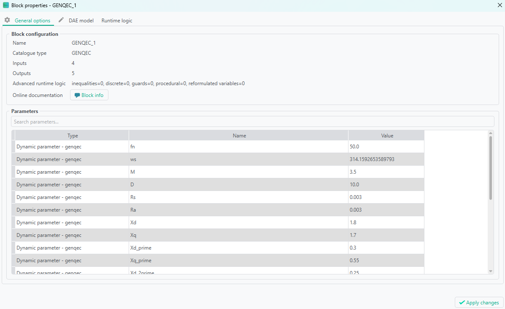
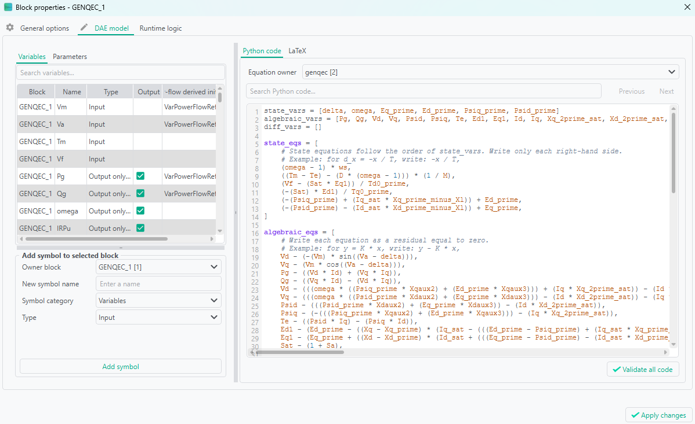

# Writing DAE models in VeraGrid

This guide explains how to author dynamic models with VeraGrid's symbolic `Block` system. It covers the mathematical contract, every user-facing part of a block, initialization, network and API mappings, hierarchical composition, retained runtime values, procedural logic, and the equivalent workflows in Python and the Dynamic Model Editor.

Use this guide when you need to create a new RMS or EMT model. Use the [Dynamic model library](dynamic_model_library_index.md) when you need the reference page for an existing model or reusable block, and [Dynamic simulations](dynamic_simulations.md) for the theory and simulation workflow.

## The mental model

A VeraGrid dynamic model is a hierarchy of symbolic blocks. Each primitive block contributes variables and equations to a global differential-algebraic equation (DAE) problem:

$$
\dot{x} = f(x, y, p, r, t)
$$

$$
0 = g(x, y, p, r, t)
$$

where:

- $x$ contains continuous state variables;
- $y$ contains algebraic variables;
- $p$ contains fixed or event-enabled parameters;
- $r$ contains retained runtime values used by procedural logic;
- $t$ is simulation time.

The solver does not execute a block diagram one box at a time. It flattens the model hierarchy, assembles all continuous equations into one numerical problem, initializes a consistent operating point, and solves the coupled system. The diagram, children, and ports organize that mathematical model and define how it connects to the rest of the grid.

Procedural logic is deliberately separate. It runs at accepted simulation boundaries and updates retained values outside the continuous Newton residual. This separation prevents a residual evaluation from mutating model memory or choosing a different branch midway through a nonlinear iteration.

## From a template to the global problem

The main stages are:

1. A template builder creates symbolic variables through the grid's `VarFactory`.
2. Primitive `Block` objects declare their variables, equations, parameters, initialization, and ports.
3. A root `Block` groups the primitive blocks and exposes the device-level interface.
4. `external_mapping` connects that interface to grid and power-flow semantics.
5. `api_obj_mapping` copies compatible static device data into model parameters.
6. `set_rms_model()` or `set_emt_model()` attaches the model and connects it to its bus or buses.
7. The RMS or EMT problem builder flattens the hierarchy, initializes the model, and compiles the numerical evaluators.
8. During the simulation, scheduled events update `event_dict` parameters and procedural entries update retained values stored internally in `mode_dict` at accepted boundaries.

## Anatomy of a `Block`

The `Block` class is defined in `VeraGridEngine.Utils.Symbolic.block`. The following table describes the fields relevant to model authors.

| Field | Meaning | Authoring rule |
| --- | --- | --- |
| `name` | Human-readable block name | Give every meaningful child a short, stable name. |
| `state_vars` | Continuous state variables $x$ | Keep the same order as `state_eqs`. |
| `state_eqs` | Right-hand sides $\dot{x}=f(\cdot)$ | Write only the derivative right-hand side, not `d_x - f`. |
| `algebraic_vars` | Algebraic unknowns $y$ | Keep the same order as `algebraic_eqs`. |
| `algebraic_eqs` | Algebraic residuals $g(\cdot)=0$ | Write `left - right`, so the stored expression must equal zero. |
| `parameters` | Constants fixed for the simulation | Use for physical or controller data that are not event targets. |
| `event_dict` | Runtime parameters that scheduled events may change | Use only for quantities intentionally exposed to events. |
| `mode_dict` | Retained runtime values and their startup expressions | This is the internal storage name. In the GUI, create and edit these values under **Runtime logic → Retained modes**, not as parameters. A value may have one procedural writer, or no writer when it is intentionally retained/external. |
| `init_values` | Direct initialization values or guesses | Use when a direct value is clearer than an equation. |
| `init_eqs` | Variable-to-expression initialization rules | Provide a physically consistent startup relation for states, algebraic variables, and unresolved runtime parameters. |
| `diff_init_eqs` | Initialization rules for derivative variables | Use when the formulation explicitly declares `diff_vars`. |
| `in_vars` | Signals or network quantities consumed by the block | Inputs are supplied by another block or by a bus connection. |
| `out_vars` | Variables exposed to other blocks or the root interface | An output is normally also a state, algebraic variable, or retained value. |
| `children` | Nested blocks | Use children to preserve physical and control structure. |
| `external_mapping` | Semantic network and power-flow references | Map a `VarPowerFlowReferenceType` to the exact model `Var` representing it. `None` is reserved for an optional or currently unconnected semantic slot managed by connection helpers. |
| `api_obj_mapping` | Static device-property references | Map a `ParamPowerFlowReferenceType` to the exact parameter `Var` that receives the value. |
| `procedural_logic` | Ordered runtime logic entries | Writers execute in list order at accepted boundaries. |
| `inequalities` | Inequality constraints | Treat as an advanced formulation feature; verify solver support before relying on it. |
| `diff_vars` | Explicit derivative variables | Use only when the chosen formulation requires explicit derivative symbols. |
| `differential_eqs` | Legacy differential residual representation | Prefer `state_vars` plus `state_eqs` for new models. |
| `discrete_eqs` and `boolean_guards` | Advanced discrete/guard representation | Prefer the public procedural-logic API for new stateful switching logic unless implementing a solver-specific formulation. |
| `reformulated_vars` | Auxiliary variables introduced during reformulation | Normally compiler-owned rather than manually authored. |
| `is_decomposable` | Whether equations may be exposed as smaller graphical blocks | Leave enabled unless the model must remain atomic. |
| `diagram` and `connection_intents` | Persisted editor layout and semantic connection state | Let the Dynamic Model Editor manage these in normal authoring workflows. |

`uid` and each variable's symbolic identities are infrastructure, not model parameters. Do not generate, copy, or rewrite them manually. Use `VarFactory` and the connection helpers so identity propagation remains consistent.

## Variables and symbolic expressions

Create variables and constants through the `VarFactory` associated with the grid:

```python
voltage: Var = var_factory.add_var(
    name="Vm",
    reference=VarPowerFlowReferenceType.Vm,
)
gain: Var = var_factory.add_var(name="K")
gain_value: Const = var_factory.add_const(2.0)
epsilon: Const = var_factory.add_const(1e-9)
```

Do not create a second `Var` merely because it has the same name. Connections depend on symbolic identity, not only on display names.

Symbolic expressions support ordinary arithmetic such as `+`, `-`, `*`, `/`, powers, and the functions exposed by `VeraGridEngine.Utils.Symbolic.symbolic`, including trigonometric, exponential, logarithmic, square-root, complex, limiter, and comparison operations. Import the symbolic module with a clear alias when several functions are needed:

```python
import VeraGridEngine.Utils.Symbolic.symbolic as sym

current_magnitude: Expr = sym.sqrt(current_d * current_d + current_q * current_q + epsilon)
limited_reference: Expr = sym.hard_sat(reference, lower_limit, upper_limit)
```

The symbolic expression tree is later differentiated, substituted, serialized, and compiled. Avoid ordinary Python branching based on a symbolic comparison. A symbolic expression is a model description, not a numeric value available while the template is being built.

### State equations

For the physical equation

$$
T\dot{x}=u-x,
$$

declare `x` in `state_vars` and store only the right-hand side in `state_eqs`:

```python
block.state_vars = list([x])
block.state_eqs = list([(u - x) / (time_constant + epsilon)])
```

`state_vars[i]` and `state_eqs[i]` are one pair. A mismatch in length or order changes the mathematical model.

### Algebraic equations

For the physical equation $y=Kx$, declare `y` as an algebraic variable and store a zero residual:

```python
block.algebraic_vars = list([y])
block.algebraic_eqs = list([y - gain * x])
```

Do not store only `gain * x`; that would mean `gain * x = 0`, not `y = gain * x`.

### Fixed parameters, dynamic parameters, and retained runtime values

These three storage categories serve different purposes. A retained value is not a third kind of parameter in the authoring interface, even though it is stored in the runtime parameter vector internally.

| Storage | Lifetime and writers | Typical use | Dynamic Model Editor |
| --- | --- | --- | --- |
| `parameters` | Fixed while the simulation runs; populated by the template or `api_obj_mapping` | resistance, inductance, fixed gain, fixed time constant | **Parameters → Parameter** |
| `event_dict` | Runtime-changeable; scheduled events are its normal public writer, and some procedural entries can explicitly target mutable runtime values | set-point, breaker command, disturbance magnitude | **Parameters → Dynamic parameter** |
| `mode_dict` | Retained across accepted boundaries; normally written by at most one procedural entry, or intentionally left without a writer as retained/external data | latch state, sampled value, delayed signal, operating mode | **Runtime logic → Retained modes** |

For each dictionary, the key is the symbolic variable and the value is its initial expression or constant. `Const(None)` is useful for a dynamic parameter whose initial value must be recovered through `init_eqs`, for example from a solved active-power value. An unchanged unresolved value remains unset in the GUI until initialization supplies it.

Do not put every tunable number in `event_dict`. Dynamic parameters occupy the runtime parameter vector and form part of the public event interface. A fixed machine reactance belongs in `parameters`; an active-power reference intended for a step or ramp belongs in `event_dict`. Do not describe or create a retained runtime value as a “mode parameter”: `mode_dict` is the persisted engine field, while **Retained mode** is the current authoring concept.

## Initialization

A dynamic model must start from a point that satisfies its algebraic equations and is consistent with its states, parameters, and the solved network operating point.

### `init_eqs`

`init_eqs` maps a target variable to the expression used to initialize it:

```python
block.init_eqs = dict({
    state: input_signal,
    output: input_signal,
    reference: solved_power,
})
```

The direction is always `target: initial_expression`. Initialization equations are not the time-domain residuals; they are a separate construction of the starting point.

Good initialization equations should:

- use power-flow quantities through `external_mapping` where appropriate;
- reconstruct internal controller and electrical variables from that operating point;
- provide consistent initial values for continuous states;
- initialize unresolved `Const(None)` dynamic parameters;
- avoid contradictory assignments and circular dependencies;
- use the same sign and per-unit conventions as the time-domain equations.

### `init_values`

Use `init_values` for direct startup values or useful initial guesses when no symbolic relationship is needed. Prefer a meaningful physical expression in `init_eqs` when the value depends on the operating point.

### `diff_init_eqs`

When a formulation declares explicit derivative variables in `diff_vars`, `diff_init_eqs` supplies their initial expressions. New state-space models normally use `state_vars` and `state_eqs`, so this field is often empty.

### Validate the equilibrium

Do not accept initialization merely because the solver returns a vector. Check that:

- the power flow converged first;
- the initialization residual is small;
- state derivatives expected to be stationary are close to zero;
- the initial P, Q, voltage, current, and control references agree;
- no limiter, latch, or retained protection output starts in an unintended state.

## External mappings

`external_mapping` connects model variables to semantic network and solved-operating-point quantities. Its keys are `VarPowerFlowReferenceType` enum members. A live mapping value is the exact `Var` object used by the model:

```python
root.external_mapping = dict({
    VarPowerFlowReferenceType.Vm: voltage_magnitude,
    VarPowerFlowReferenceType.Va: voltage_angle,
    VarPowerFlowReferenceType.P: active_power,
    VarPowerFlowReferenceType.Q: reactive_power,
})
```

This mapping has two related roles:

- it tells the connection helpers which variables represent the device's bus-facing contract;
- it tells initialization which symbolic variables correspond to power-flow results.

Use the reference that matches the topology and formulation:

- single-bus RMS injections commonly use `Vm`, `Va`, `P`, and `Q`;
- RMS branches distinguish `Vmf`/`Vaf` and `Vmt`/`Vat`, with corresponding from/to powers and currents;
- EMT injections use `Vdc` or the active phase references `v_N`, `v_A`, `v_B`, and `v_C`;
- EMT branches use from/to references such as `vf_A`, `vt_A`, `if_A`, and `it_A`.

The complete and current set is defined by `VarPowerFlowReferenceType` and is offered by the GUI mapping selector.

Some topology and attachment helpers preserve a key with a `None` value to mean that an optional semantic slot is declared but currently inactive or unconnected. Do not use `None` for a required live interface: once the corresponding phase, side, or quantity is active, map it to the authoritative variable identity.

For composite models, keep the authoritative device-level mapping on the root block even when the mapped variable is owned by a child. Root mappings, root ports, and internal equations must all refer to the same symbolic identity. Do not create a duplicate root variable with the same name.

## API object mappings

`api_obj_mapping` maps static grid-device properties to dynamic model parameter variables:

```python
root.api_obj_mapping = dict({
    ParamPowerFlowReferenceType.Pl0: initial_active_power,
    ParamPowerFlowReferenceType.Ql0: initial_reactive_power,
})
```

This is different from `external_mapping`:

- `external_mapping` identifies operating-point and network-interface variables;
- `api_obj_mapping` identifies configuration values copied from the associated API device.

The public mapping contract is static-device data to a fixed model parameter. The mapped value must therefore be the same `Var` that appears in `parameters`, not in `event_dict` or `mode_dict`. Use one semantic mapping key only once in the effective block hierarchy. The available keys and their intended units are defined by `ParamPowerFlowReferenceType`; use the GUI selector or inspect that enum rather than inventing a string key.

Dynamic parameters do not expose an API mapping selector in the GUI. If a runtime reference must start from static device data, map that data to a fixed parameter and use the fixed parameter in the runtime reference's initialization expression. Controller-specific gains with no corresponding static device property should retain their template value; place them in `parameters` unless they are genuine event targets.

## Ports, children, and connections

### Inputs and outputs

`in_vars` and `out_vars` form a block's explicit interface:

- an input is consumed by the block and produced elsewhere;
- an output is owned by the block and exposed to another block or to the device root;
- a root input or output is part of the saved device contract.

Marking a variable as an output does not create an equation and does not remove it from its state or algebraic collection. It only exposes the existing variable.

### Hierarchical composition

Use children to group a model by physical and control responsibility:

```text
Converter
├── Electrical plant
├── Measurements and PLL
├── Outer power/voltage controller
├── Inner current controller
├── Modulator
└── Protection and runtime logic
```

Each child should be understandable and testable in isolation. The root should mainly own the device-level contract: children, root ports, mappings, and any genuinely global parameters.

Add a child with `root.add(child)` or `root.children.append(child)`. Do not flatten a composite model manually. The problem builder performs the authoritative flattening while the editor preserves the hierarchy.

### Connecting children in scripting

For explicit connections, use `VarFactory.add_connections()` with target inputs first and source outputs second:

```python
var_factory.add_connections(
    list([controller.in_vars[0]]),
    list([measurement.out_vars[0]]),
)
```

`connect_models()` can connect compatible child ports that share a non-empty shared reference. Network-facing RMS and EMT models should be attached with `set_rms_model()` or `set_emt_model()` rather than by manually rewriting variable identities.

## Retained runtime values and procedural logic

Procedural logic represents sampled, delayed, stateful, or discontinuous decisions that should not mutate the continuous DAE residual during Newton iterations.

The runtime sequence is conceptually:

1. `mode_dict` supplies startup expressions for retained runtime values.
2. After continuous initialization, procedural entries evaluate once at the initialized operating point.
3. The solver advances and accepts a time step.
4. Procedural entries run in their stored order using the accepted state and current runtime parameters.
5. They update their retained outputs for the next solve.
6. Timed entries may request an exact forced event time inside a nominal integration step.

A retained value therefore has memory across accepted steps but is not a continuous state and is not solved by Newton. The name `mode_dict` remains part of the serialized engine API, but its contents are authored separately from fixed and dynamic parameters.

### A procedural latch

The following fragment creates an undervoltage latch. The continuous equations may read `trip_mode`, while the procedural entry is its only writer:

```python
from VeraGridEngine.Utils.procedural_logic import flipflop

trip_mode: Var = var_factory.add_var(name="trip_mode")
trip_voltage: Var = var_factory.add_var(name="V_trip")
reset_voltage: Var = var_factory.add_var(name="V_reset")

block.mode_dict[trip_mode] = var_factory.add_const(0.0)
block.parameters[trip_voltage] = var_factory.add_const(0.80)
block.parameters[reset_voltage] = var_factory.add_const(0.90)
block.procedural_logic = list([
    flipflop(
        boolset=voltage_magnitude <= trip_voltage,
        boolreset=voltage_magnitude >= reset_voltage,
        output=trip_mode,
        name="undervoltage_trip",
    ),
])
```

The different trip and reset thresholds provide hysteresis and avoid chatter. A continuous residual can then use `1.0 - trip_mode` as an enable factor.

### Rules for procedural logic

- Declare retained outputs in `mode_dict` before adding their writers.
- Give a retained output at most one procedural writer. Zero writers are allowed for intentionally retained/external values and produce a GUI warning; document who changes such a value.
- Order entries deliberately. If one entry reads a retained value written by another entry at the same boundary, place the writer first unless a one-step delay is intentional.
- Keep retained-value names unique across the effective block hierarchy.
- Use hysteresis or pickup/dropoff delays around noisy thresholds.
- Use procedural logic for latches, timers, exact handovers, delayed values, moving averages, retained samples, and discontinuous switching decisions.
- Use continuous state equations for physical energy storage and controller integrators.
- Do not use procedural memory to hide an algebraic loop that should be modelled and solved explicitly.

Equation-level `select()` and `ifelse()` are intentionally blocked in the public procedural API. Move the switching decision to `procedural_logic` and consume its retained output in the equations, or use a physically justified smooth continuous approximation.

The available runtime entries are documented under [Runtime procedural logic](dyn_templates/procedural_logic/index.md).

## A complete scripting example

This example builds a small RMS constant-power load with a first-order active-power reference. It demonstrates states, algebraic residuals, fixed and dynamic parameters, initialization, both mappings, and the device-level interface.

```python
from VeraGridEngine.Devices.Dynamic.rms_template import RmsModelTemplate
from VeraGridEngine.Devices.Dynamic.var_factory import VarFactory
from VeraGridEngine.Utils.Symbolic.block import Block
from VeraGridEngine.Utils.Symbolic.symbolic import Const, Var
from VeraGridEngine.enumerations import (
    DeviceType,
    ParamPowerFlowReferenceType,
    VarPowerFlowReferenceType,
)


def build_lagged_load_rms(
    var_factory: VarFactory,
    name: str = "Lagged RMS load",
) -> RmsModelTemplate:
    """Build a constant-Q load with a lagged active-power reference.

    :param var_factory: Grid-owned factory used to create symbolic identities.
    :param name: Human-readable template and root-block name.
    :return: RMS load template ready to attach to a load device.
    """
    template: RmsModelTemplate = RmsModelTemplate(name=name)
    template.tpe = DeviceType.LoadDevice

    # The bus supplies voltage, while the load exposes solved active and
    # reactive power through the root contract.
    voltage_magnitude: Var = var_factory.add_var(
        name="Vm",
        reference=VarPowerFlowReferenceType.Vm,
    )
    voltage_angle: Var = var_factory.add_var(
        name="Va",
        reference=VarPowerFlowReferenceType.Va,
    )
    active_power: Var = var_factory.add_var(
        name="Pl",
        reference=VarPowerFlowReferenceType.P,
    )
    reactive_power: Var = var_factory.add_var(
        name="Ql",
        reference=VarPowerFlowReferenceType.Q,
    )

    # The filtered reference is a physical controller state. The two runtime
    # references are dynamic parameters because grid events may change them.
    filtered_active_power: Var = var_factory.add_var(name="Pl_filtered")
    active_power_reference: Var = var_factory.add_var(name="Pl_ref")
    reactive_power_reference: Var = var_factory.add_var(name="Ql_ref")

    # API mappings populate fixed parameters only. These seed parameters
    # receive the associated static Load values and initialize the references.
    initial_active_power: Var = var_factory.add_var(name="Pl0_device")
    initial_reactive_power: Var = var_factory.add_var(name="Ql0_device")
    time_constant: Var = var_factory.add_var(name="T_p")

    # The time constant is required to be positive. A very small regularizer
    # protects evaluation at an accidental zero without replacing validation.
    time_constant_value: Const = var_factory.add_const(0.10)
    epsilon: Const = var_factory.add_const(1e-9)

    root: Block = Block(
        name=name,
        state_vars=list([filtered_active_power]),
        state_eqs=list([
            (active_power_reference - filtered_active_power)
            / (time_constant + epsilon),
        ]),
        algebraic_vars=list([active_power, reactive_power]),
        algebraic_eqs=list([
            active_power - filtered_active_power,
            reactive_power - reactive_power_reference,
        ]),
        parameters=dict({
            time_constant: time_constant_value,
            initial_active_power: var_factory.add_const(0.0),
            initial_reactive_power: var_factory.add_const(0.0),
        }),
        event_dict=dict({
            active_power_reference: var_factory.add_const(None),
            reactive_power_reference: var_factory.add_const(None),
        }),
        init_eqs=dict({
            active_power_reference: initial_active_power,
            reactive_power_reference: initial_reactive_power,
            filtered_active_power: initial_active_power,
        }),
        in_vars=list([voltage_magnitude, voltage_angle]),
        out_vars=list([active_power, reactive_power]),
        external_mapping=dict({
            VarPowerFlowReferenceType.Vm: voltage_magnitude,
            VarPowerFlowReferenceType.Va: voltage_angle,
            VarPowerFlowReferenceType.P: active_power,
            VarPowerFlowReferenceType.Q: reactive_power,
        }),
        api_obj_mapping=dict({
            ParamPowerFlowReferenceType.Pl0: initial_active_power,
            ParamPowerFlowReferenceType.Ql0: initial_reactive_power,
        }),
    )

    template.block = root
    return template
```

Attach the block with the shared grid factory and the standard connection helper:

```python
from VeraGridEngine.Utils.Symbolic.bus_rms_template import initialize_bus_rms
from VeraGridEngine.Utils.Symbolic.templates_common_functions import set_rms_model


initialize_bus_rms(bus=load.bus, vf=grid.var_factory)
load_template: RmsModelTemplate = build_lagged_load_rms(
    var_factory=grid.var_factory,
)
set_rms_model(
    device=load,
    model=load_template.block,
    var_factory=grid.var_factory,
)
```

For EMT, return an `EmtModelTemplate`, use phase or DC references appropriate to the device, and attach its block with `set_emt_model()`. Do not import GUI modules into `VeraGridEngine`; the same engine block must work without Qt.

### Making a template editable as a catalogue item

A reusable template builder may subclass `TemplateDefinition` and expose structural inputs through typed `TemplateProp` entries. Its `eval()` method returns the configured `RmsModelTemplate` or `EmtModelTemplate`. Use structural properties only for choices that rebuild the model, such as active phases or winding configuration. Ordinary numeric gains and time constants belong in the block parameter collections so the Block Properties editor can modify them without reconstructing the topology.

## Authoring in the Dynamic Model Editor

The GUI edits the same `Block` objects used by scripting. There is no separate graphical model format.

### Open and compose a model

1. Build and solve the static network first.
2. Right-click the target device and open the **RMS editor** or **EMT editor**.
3. Keep the automatically provided grid-connection blocks; they define the live bus-facing interface.
4. Drag device templates or basic blocks from **Dynamic library** onto the canvas.
5. Connect output ports to compatible input ports.
6. Split a large model into named children such as plant, measurements, outer control, inner control, and protection.
7. Use the workspace **Validate** action before saving the model.
8. Use the editor's apply/save button and confirm the **Model saved** notification. Until then, the editor is working on an isolated copy.

The [RMS practical session](RMS_practical_session.md) and [EMT practical session](EMT_practical_session.md) show the device-level workflow with screenshots.

### Block Properties

Double-click a block to open **Block properties**. The main pages are:

- **General options**: block identity, generated structural settings, fixed parameters, and dynamic parameters. Retained runtime values are deliberately not edited here.



- **DAE model**: recursive Variables and Parameters tables, the equation owner selector, safe Python-like DAE code with mathematical algebraic equalities, copyable LaTeX source, and rendered PDF export.



- **Runtime logic**: retained runtime values and ordered procedural entries. Its two subpages are **Procedural entries** and **Retained modes**.
- **Special settings**: structured builder data for blocks that need it, such as lookup tables.


Edits in the dialog are staged. **Apply changes** validates the complete draft and applies it atomically to the editor working copy; it does not by itself save the complete device model back to the grid.

### Variables and mappings in the GUI

Use the Variables and Parameters tables to declare DAE symbols and parameter storage:

- **Variables** offers Input, State, and Algebraic. When a formulation needs an explicit derivative symbol, create it with its state; existing derivative symbols are shown as Differential.
- **Parameters** offers Parameter for fixed constants and Dynamic parameter for `event_dict` values.
- **Runtime logic → Retained modes** is the only current GUI location for creating and editing `mode_dict` values. There is no Mode parameter choice in the add-symbol form or either visible symbol table.

The mapping column assigns `VarPowerFlowReferenceType` to network-facing variables and `ParamPowerFlowReferenceType` to fixed parameters. Dynamic parameters do not accept a static API mapping in the GUI. Do not simulate a mapping by merely renaming a variable to `Vm`, `P`, or `r`; the semantic enum selection is what creates the contract.

The Output checkbox exposes an existing variable as a port or result. It does not turn an input into an equation, and it does not remove a variable from its original role.

### DAE code in the GUI

The **Python code** page is a safe assignment-only DAE editor, not a general Python console. It extends the expression syntax with one mathematical `=` inside each algebraic equation. The three variable declarations are projections of the Variables table and define equation ordering:

```python
state_vars = [x]
algebraic_vars = [y]
diff_vars = []

state_eqs = {
    # Associate every state explicitly with the right-hand side of its derivative.
    x: (u - x) / (T + eps),
}

algebraic_eqs = [
    # Complete equality; ``0 = y - K * x`` is also accepted.
    y = K * x,
]

init_eqs = {
    x: u,
    y: K * u,
}

diff_init_eqs = {}
```

Create or reclassify variables with the tables, not by inventing undeclared names in the code. Every key in `state_eqs` must occur exactly once in `state_vars`; the editor converts this explicit mapping to the Engine's positional equation list using `state_vars` order. Every `algebraic_eqs` entry must contain exactly one single equality sign (`=`, not `==`). The GUI accepts either `0 = residual` or a physical relation such as `y = K * x`, then converts it to the residual expression stored by the Engine. Select the appropriate **Equation owner** when editing a composite model. **Validate all code** checks every recursive equation buffer and focuses the first inline error.

### Runtime logic in the GUI

In **Runtime logic**:

1. Open **Retained modes**, choose the owner block, and add each retained value with its startup expression.
2. Add procedural entries and choose their type.
3. Bind every output, target, expression, delay, threshold, or limit field.
4. Put entries in their intended execution order.
5. Press **Validate runtime logic**.
6. Fix unknown references, missing retained outputs, duplicate writers, invalid expressions, and order-dependent reads before applying. A retained value with no procedural writer is accepted with a warning because it is treated as retained/external.

The editor serializes the same `mode_dict` and `procedural_logic` structures shown in the scripting examples. `mode_dict` is therefore still visible in code and saved data, but it must not be confused with the obsolete Mode parameter authoring role.

## Good habits

### Organize by responsibility

- Keep the electrical plant, measurements, controls, modulation, and protection in separate children.
- Give blocks and variables stable engineering names.
- Expose only the ports needed by other children or by the root contract.
- Keep network mappings and static API mappings easy to find at the root.
- Avoid one enormous primitive block containing an entire converter or generator.

### Make numerical domains explicit

- State the sign convention for currents and powers.
- State whether every quantity is SI, per unit, RMS, peak, phase, dq, or complex phasor.
- Use one base convention throughout a child and convert at a clear boundary.
- Keep phase ordering explicit and consistent, normally N-A-B-C or A-B-C as required by the template.

### Protect mathematical domains

- Protect denominators that may legitimately approach zero.
- Add a small epsilon to positive quantities such as voltage magnitudes when division cannot be avoided.
- For squared norms, use a form such as `sqrt(x * x + y * y + eps)`.
- Protect square-root and logarithm domains with physically meaningful bounds.
- Validate time constants, inductances, capacitances, bases, and rated values as strictly positive when the physics requires it.
- Do not use epsilon to conceal an invalid model parameter. A regularizer should protect a legitimate limiting case, not make negative or nonsensical data appear valid.
- Choose epsilon relative to the model's scaling. A value harmless in per unit may be inappropriate in SI units.

For a denominator whose sign matters, blindly writing `denominator + eps` can change the physics near zero. Prefer a formulation derived from the physical limit, a magnitude bound with explicit sign handling, or explicit runtime logic that handles the singular operating region.

### Preserve DAE quality

- Keep one equation per declared state and algebraic unknown, in the same order.
- Write algebraic equations as explicit zero residuals.
- Avoid redundant equations and duplicated unknowns.
- Avoid hidden algebraic loops between child interfaces when a single local equation would be clearer.
- Prefer smooth expressions inside Newton residuals.
- Move true latches and discontinuous decisions to procedural logic.
- Check units and scaling so residuals have comparable numerical magnitudes.

### Design initialization with the model

- Write initialization equations while writing the dynamic equations, not afterward.
- Derive internal states from the solved operating point whenever possible.
- Initialize controller references so their initial error is zero unless a startup transient is intentional.
- Initialize limiter and protection modes consistently with the initial measurement.
- Test explicit initialization on several realistic operating points, not only at nominal voltage and zero reactive power.

### Keep runtime categories honest

- Fixed configuration belongs in `parameters`.
- User-scheduled disturbances belong in `event_dict`.
- Retained logic outputs belong in `mode_dict`.
- Continuous memory belongs in `state_vars`.
- Give each procedurally written retained value exactly one writer; document values intentionally left retained/external without one.
- Avoid reading a later writer unless a one-step delay is part of the model.

### Build and test incrementally

- Validate a primitive child before composing the whole device.
- Start with one device connected to a small network.
- Test initialization separately from a time-domain event.
- Apply steps to one dynamic parameter at a time.
- Inspect states, algebraic variables, retained values, and dynamic parameters around every discontinuity.
- Compare steady state, small-signal behavior where applicable, and time-domain response against an analytical result or trusted reference.

## Common failure modes

| Symptom | Likely cause | What to inspect |
| --- | --- | --- |
| Unknown symbol in the GUI | The symbol was typed in code but not declared in the tables | Add or map it in Variables/Parameters and revalidate all owners. |
| State/equation count error | `state_vars` and `state_eqs` differ in length or order | Pair each state with one right-hand side. |
| Singular Jacobian | Missing equation, redundant equation, unconnected input, or zero-domain expression | Count unknowns/residuals, inspect ports, and check denominators. |
| Initialization fails | Incomplete or contradictory `init_eqs`, wrong sign, or missing external mapping | Compare the time-domain equations with the startup operating point. |
| Model does not connect to the bus | Wrong `VarPowerFlowReferenceType`, missing root port, or duplicated root variable | Inspect the root interface and attach with the standard helper. |
| Static data are ignored | Missing or incorrect `api_obj_mapping` | Map the correct enum member to the exact parameter variable. |
| An event cannot find a parameter | The quantity is in `parameters` rather than `event_dict` | Promote only the intended event target to `event_dict`. |
| A retained value expected to change never does | Missing procedural writer or output not declared in `mode_dict` | Validate runtime logic and inspect the output binding. A no-writer warning is acceptable only when external retention is intentional. |
| A retained value changes one step late | Reader appears before writer | Reorder entries or document the intentional delay. |
| Switching chatters | No hysteresis, delay, or retained state around a threshold | Use separate pickup/dropoff thresholds or procedural relay logic. |
| GUI changes disappear | The Block Properties draft was applied, but the complete editor model was not saved | Apply the editor working copy and confirm **Model saved**. |

## Where new models and documentation belong

Place engine templates according to their simulation domain:

- RMS device templates: `src/VeraGridEngine/Templates/Rms/`
- EMT device templates: `src/VeraGridEngine/Templates/Emt/`
- reusable editor catalogue blocks: `src/VeraGridEngine/Templates/BasicBlockCatalog/`
- generic symbolic infrastructure: `src/VeraGridEngine/Utils/Symbolic/`
- procedural runtime entries: `src/VeraGridEngine/Utils/procedural_logic.py`

`VeraGridEngine` must remain independent of the Qt GUI. A model that needs a GUI class to build or run is in the wrong architectural layer.

Place user-facing reference documentation here:

- RMS model pages: `doc/md_source/dyn_templates/RMS/`
- EMT model pages: `doc/md_source/dyn_templates/EMT/`
- reusable block pages: `doc/md_source/dyn_templates/library/`
- procedural entry pages: `doc/md_source/dyn_templates/procedural_logic/`

Each new model page should document its physical purpose, equations, interface, parameter units, initialization assumptions, mappings, procedural behavior, and known domain limitations. Add or generate the corresponding catalogue entry so the model remains reachable from the [Dynamic model library](dynamic_model_library_index.md).

## Author checklist

Before considering a model complete, verify all of the following:

- [ ] The physical domain, sign convention, units, and bases are documented.
- [ ] Every symbol was created through the shared `VarFactory`.
- [ ] State and algebraic equation counts and ordering are correct.
- [ ] Algebraic equations are zero residuals.
- [ ] Fixed parameters, dynamic parameters, retained runtime values, and continuous states have distinct roles.
- [ ] Initialization is consistent with a converged power flow.
- [ ] Root `in_vars`, `out_vars`, and `external_mapping` describe the same interface.
- [ ] `api_obj_mapping` uses enum keys and exact model variables.
- [ ] Large models are divided into meaningful children.
- [ ] Divisions, square roots, logarithms, and other restricted domains are protected appropriately.
- [ ] Discontinuous memory and latches use ordered procedural logic.
- [ ] Runtime logic has no missing retained references, duplicate writers, or accidental order dependence; any no-writer warnings are intentional and documented.
- [ ] The model validates in the GUI and through scripting.
- [ ] Initialization and at least one event response have automated tests.
- [ ] A documentation page is linked from the appropriate dynamic-template index.
