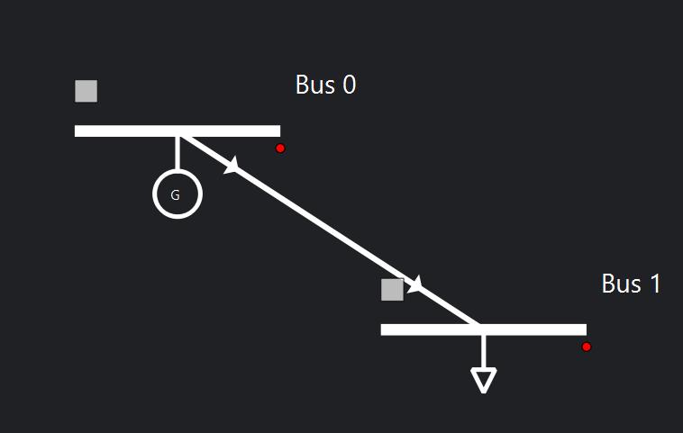
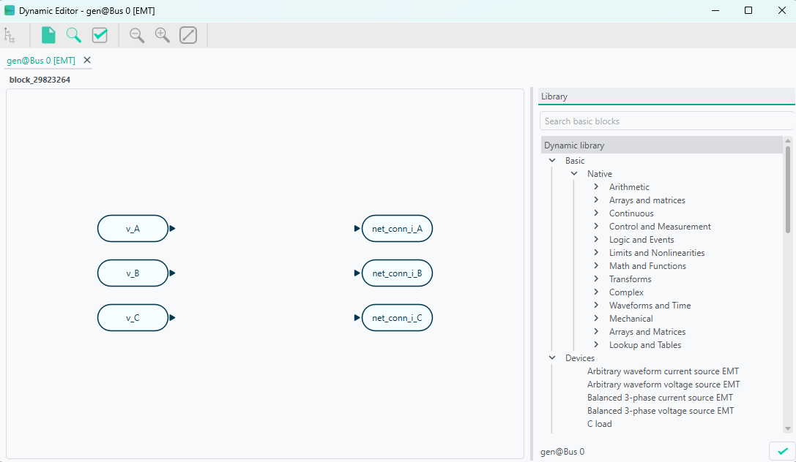
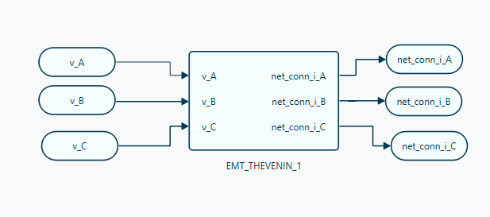
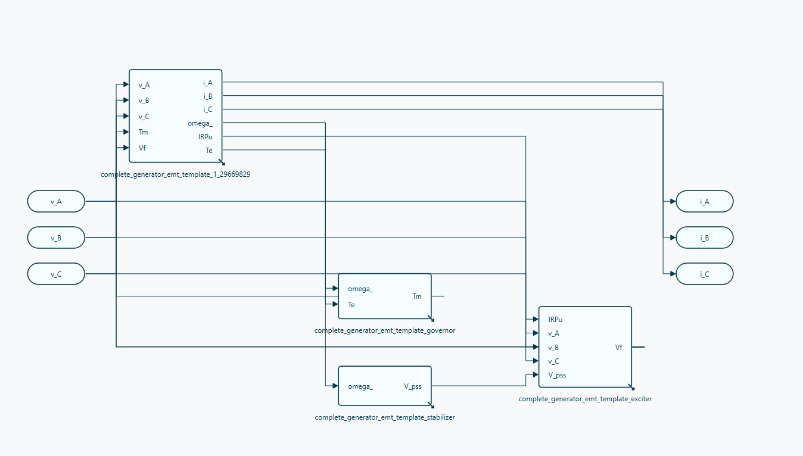

# 🔬 EMT simulations

Electromagnetic transient (EMT) simulation is VeraGrid's waveform-domain dynamic-simulation workflow for fast electrical phenomena. It is used when the study requires instantaneous voltages and currents, explicit switching behaviour, or phase-domain detail that cannot be represented accurately in RMS simulation.

Compared with RMS, EMT provides much higher electromagnetic fidelity at a significantly higher computational cost.

The settled periodic trajectories produced by the EMT model can also be assessed with VeraGrid's Floquet Small-Signal analysis.

```{toctree}
:maxdepth: 1

small_signal_stability_emt
```

## When to use EMT simulation

Use EMT simulation when the study objective is mainly related to:

- switching transients,
- waveform distortion,
- converter inner-loop interactions,
- protection-driven discontinuities,
- detailed line or transformer transients,
- phase-domain and unbalanced systems,
- fast control interactions that RMS cannot represent reliably.

If the main interest is electromechanical or controller-level behaviour, use [RMS simulations](rms_simulations.md) instead.

## EMT workflow in VeraGrid

In VeraGrid, an EMT simulation is built from:

- a static network model,
- a consistent operating point used for initialization,
- EMT dynamic models assigned to the relevant devices,
- optional EMT events,
- one initialization workflow, one integration method, and one solver backend.

The practical EMT workflow is:

1. Build or import the grid model.
2. Run a static study to obtain a consistent operating point.
3. Assign EMT models to the devices that need waveform-level representation.
4. Configure EMT events such as switching or parameter changes.
5. Select EMT options such as total simulation time, time step, tolerance, solver type, and initialization method.
6. Run the simulation and inspect voltages, currents, state variables, and event responses.

## EMT settings

The EMT workflow is driven through `EmtOptions` and `EmtSimulationDriver`.

The main user-facing `EmtOptions` fields are:

- `solver_type`: EMT backend to use.
- `integration_method`: the standard workflow uses `DynamicIntegrationMethod.DaeTrapezoidal`.
- `initialization_method`: EMT initialization workflow.
- `problem_type`: internal EMT formulation.
- `time_step`: EMT integration step.
- `simulation_time`: total EMT simulation horizon.
- `tolerance`: numerical tolerance.

Advanced `EmtOptions` fields also expose:

- initialization Newton controls,
- pseudo-transient initialization controls,
- sparse-solver settings,
- Newton diagnostics and stabilization settings,
- compiled solver warmup policy.

As a practical rule, EMT time steps are typically in the microsecond range.

## EMT events

EMT events are used to modify the system during the simulation. Typical examples are:

- load-impedance changes,
- source or converter reference changes,
- switching actions,
- faults,
- time-varying parameter changes.

In VeraGrid, EMT events are organized through:

- `EmtEventsGroup`: one simulation scenario,
- `EmtEvent`: one runtime parameter change inside that scenario.

## GUI example

The following compact example is adapted from [EMT_practical_session.md](EMT_practical_session.md), omitting the generic platform introduction.

### Example objective

Build a 2-bus EMT model with:

- one generator,
- one load,
- one line,
- one EMT event group that changes load resistance over time.

System sketch:



### Static network data

| Object | Parameter | Value |
|---|---|---:|
| Grid | `Sbase` | 100 MVA |
| Grid | `freq` | 50 Hz |
| Bus 0 | `is_slack` | `True` |
| Bus 0 | `Vnom` | 10 kV |
| Bus 1 | `is_slack` | `False` |
| Bus 1 | `Vnom` | 10 kV |
| Generator 1 | `Vset` | 1.0 p.u. |
| Generator 1 | `Snom` | 100 MVA |
| Generator 1 | `r1` | 0.001 |
| Generator 1 | `x1` | 1.7 |
| Load | `P` | 1 MVA |
| Load | `Pa` | 0.33333 MVA |
| Load | `Pb` | 0.33333 MVA |
| Load | `Pc` | 0.33333 MVA |
| Load | `Q` | 0.0 MVA |
| Load | `Qa` | 0.0 MVA |
| Load | `Qb` | 0.0 MVA |
| Load | `Qc` | 0.0 MVA |
| Load | `conn` | `Y` |

The practical session uses a tower-based line definition:

| Tower parameter | Value |
|---|---|
| Voltage | 10 kV |
| Wire | `-_ACSR_0.902` |

Wire placement:

| X (m) | Y (m) | Phase |
|---:|---:|---:|
| -12 | 27 | 1 |
| 0 | 27 | 2 |
| 12 | 27 | 3 |

### EMT simulation settings

| Parameter | Value |
|---|---|
| Integration | `DAE_Trapezoidal` |
| Initialisation | `Explicit` |
| Solver | `Structural Compiled` |
| Tolerance | `1e-4` |
| Simulation time | `0.06` |
| Time step | `1e-6` |

### EMT dynamic-model assignment

For this example:

- the generator can use a complete generator EMT template or a manually assembled generator/exciter/governor/stabiliser chain,
- the line typically uses an EMT Pi line or, for wave-transmission detail, a Bergeron line model,
- the load uses an R load model.

In the GUI there are two main ways to assign dynamic models:

1. Assign an `emt_template` from the device properties or from the default catalogue.
2. Open the EMT editor and build the model graphically from blocks.

The editor workflow is preferred when the parameters, equations, or controller structure must be inspected and tuned.

When opening the EMT editor, the grid connection blocks are already present. For AC devices, the phase terminals appear explicitly.



Example generator model using a Thevenin-equivalent representation:



The practical session also shows a more detailed generator build:



### EMT event example

The practical-session event set is:

| Event | Device | Time interval (s) | Parameter | New value | Transition |
|---|---|---:|---|---:|---|
| Decrease load | Load | 0.02 | `R_A` | 200 | Step |
| Decrease load | Load | 0.02 | `R_B` | 200 | Step |
| Decrease load | Load | 0.02 | `R_C` | 200 | Step |
| Increase load | Load | 0.04-0.05 | `R_A` | 300 | Ramp |
| Increase load | Load | 0.04-0.05 | `R_B` | 300 | Ramp |
| Increase load | Load | 0.04-0.05 | `R_C` | 300 | Ramp |

From the GUI, event scenarios are created by adding an `EmtEventsGroup` and then attaching `EmtEvent` objects to the selected device.

## EMT results

The EMT dynamic results are stored in `EmtResults`.

### Registered Result Properties

| Property | Type | Description |
|---|---|---|
| `time_array` | `DateVec` | Ordered simulation time samples. |
| `values` | `Vec` | Simulated EMT state and algebraic variable values. |
| `diff_values` | `Vec` | Simulated EMT differential-variable trajectories. |
| `emt_events_group_names` | `StrVec` | Ordered declared EMT event-group names. |
| `emt_events_group_idtags` | `StrVec` | Ordered declared EMT event-group identifiers. |
| `has_event_group_results` | `BoolVec` | Mask indicating which declared event groups actually produced simulation data. |
| `well_initialized` | `BoolVec` | Initialization status per event group. |
| `converged` | `BoolVec` | Convergence status per event group. |
| `dynamic_metadata_json` | `StrVec` | Serialized metadata used to reconstruct variable and device bindings. |

In practice, users normally inspect:

- `results.time_array`,
- `results.values`,
- `results.diff_values`,
- `results.converged`,
- `results.well_initialized`.

## API

The EMT scripting workflow is:

1. Build or load the grid.
2. Assign EMT templates to the dynamic devices.
3. Run a power flow or other consistent static initialization step.
4. Configure `EmtOptions`.
5. Run `EmtSimulationDriver`.
6. Read `EmtResults`.

```python
from VeraGridEngine.Devices.Substation.bus import Bus
from VeraGridEngine.Devices.Injections.generator import Generator
from VeraGridEngine.Devices.Injections.load import Load
from VeraGridEngine.Devices.Branches.line import Line

from VeraGridEngine.enumerations import DynamicIntegrationMethod, EmtInitializationMethod, EmtSolverTypes
from VeraGridEngine.Templates.Emt.pi_line_emt_template import get_pi_line_emt_template
from VeraGridEngine.Templates.Emt.thevenin_equivalent_emt_generator_template import (
    get_generator_thevenin_rl_emt_template_with_ref,
)
from VeraGridEngine.Templates.Emt.load_RLC_emt_template import get_shunt_r_emt_template
from VeraGridEngine.Utils.Symbolic.templates_common_functions import set_emt_model

from VeraGridEngine.Simulations.PowerFlow.power_flow_driver import PowerFlowOptions
from VeraGridEngine.Simulations.EMT.emt_options import EmtOptions
from VeraGridEngine.Simulations.EMT.emt_driver import EmtSimulationDriver

import VeraGridEngine.api as vg

grid = vg.MultiCircuit(Sbase=100.0, fbase=50.0)

bus0 = Bus(name="Bus0", Vnom=10.0, is_slack=True)
bus1 = Bus(name="Bus1", Vnom=10.0)
grid.add_bus(bus0)
grid.add_bus(bus1)

line = Line(name="line 0-1", bus_from=bus0, bus_to=bus1, r=0.02, x=0.08, b=0.0, rate=100.0)
grid.add_line(line)

gen = Generator(name="Gen1", P=1.0, vset=1.0, Snom=100.0, r1=0.001, x1=1.7)
grid.add_generator(bus=bus0, api_obj=gen)

load = Load(name="Load1", P=1.0, Q=0.0)
grid.add_load(bus=bus1, api_obj=load)

gen_emt = get_generator_thevenin_rl_emt_template_with_ref(grid.var_factory).block
line_emt = get_pi_line_emt_template(
    vf=grid.var_factory,
    phN=False,
    phA=True,
    phB=True,
    phC=True,
).block
load_emt = get_shunt_r_emt_template(
    vf=grid.var_factory,
    phA=True,
    phB=True,
    phC=True,
).block

set_emt_model(device=gen, model=gen_emt, var_factory=grid.var_factory)
set_emt_model(device=line, model=line_emt, var_factory=grid.var_factory)
set_emt_model(device=load, model=load_emt, var_factory=grid.var_factory)

load.emt_model.set_parameter_in_model(var_name="R_A", new_value=200.0)

pf_options = PowerFlowOptions(solver_type=vg.SolverType.NR, verbose=0)
pf_results = vg.power_flow(grid, options=pf_options)

emt_options = EmtOptions(
    time_step=1e-6,
    simulation_time=0.02,
    tolerance=1e-6,
    solver_type=EmtSolverTypes.StructuralAD,
    integration_method=DynamicIntegrationMethod.DaeTrapezoidal,
    initialization_method=EmtInitializationMethod.Auto,
    verbose=0,
)

driver = EmtSimulationDriver(grid=grid, options=emt_options, pf_results=pf_results)
driver.run()

results = driver.results
print(results.converged)
print(results.well_initialized)
print(results.values.shape)
print(results.diff_values.shape)
```

## Practical notes

- Start from a validated static model before attempting EMT.
- Keep the model scope tight, because EMT cost grows quickly.
- Use the simplest solver/backend setup that resolves the phenomenon of interest.
- Prefer EMT only when waveform-level or phase-domain fidelity is required.
- For the broad mathematical and architectural background of the dynamic engine, see [Dynamic simulations](dynamic_simulations.md).
- For local stability around a settled periodic EMT trajectory, see [EMT Small-Signal stability: Floquet analysis](small_signal_stability_emt.md).
