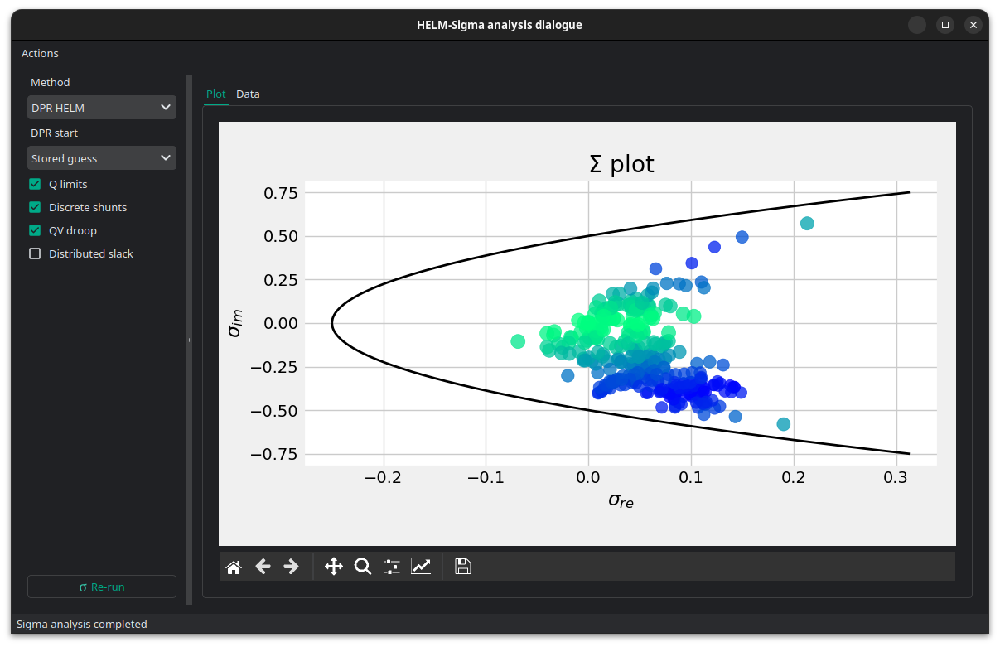

# 🌘 Sigma analysis

Sigma analysis is used to estimate how close an AC power-flow solution is to
voltage collapse. It maps each bus to a point in the sigma plane and measures
the distance from that point to the sigma stability boundary. Buses with smaller
distances are closer to the voltage-stability limit, so the study helps identify
weak areas of the grid before running heavier continuation power-flow studies.



Sigma analysis is a voltage-stability diagnostic based on the HELM
(Holomorphic Embedding Load-flow Method) voltage series. VeraGrid can compute
sigma values with the classical HELM formulation or with the DPR HELM
formulation used by the HELM power-flow solver.

The result is shown in the sigma plane and in a table with the bus-wise sigma
coordinates and distances to the sigma stability boundary.


## Options

The Sigma analysis window includes a compact rerun panel. It lets you recompute
the result without closing the plot window.

- **Method**:
  Selects the sigma formulation.
  `DPR HELM` uses the DPR formulation and the control-aware DPR power-flow
  path. `Classical HELM` uses the original single-embedding HELM sigma method.

- **DPR start**:
  Selects the initial germ for the DPR power-flow part of the sigma analysis.
  `Stored guess` uses the voltage stored in the buses as the first DPR state.
  `Classical no-load` uses the HELM no-load germ.

- **Q limits**:
  Enables reactive power limit controls for voltage-controlled buses during the
  DPR solve. If a generator reaches its reactive limit, the bus type can change
  and the DPR model is restarted.

- **Discrete shunts**:
  Enables discrete shunt controls during the DPR solve. Shunt admittance
  changes are treated as fixed-model changes, so the DPR solve restarts after
  the control action.

- **QV droop**:
  Enables generator QV droop controls during the DPR solve. Droop changes the
  specified reactive injection and therefore changes the fixed algebraic model.

- **Distributed slack**:
  Enables distributed slack redistribution during the DPR solve. This modifies
  the active-power target and requires another fixed-model DPR solve.

- **Re-run**:
  Runs sigma analysis again with the selected options and refreshes the plot and
  table in place.


## Theory

### Classical sigma

Classical sigma analysis uses one HELM embedding from the no-load solution to
the target loading condition.

The HELM voltage and inverse-voltage series are:

$$
V(s) = \sum_{k=0}^{N} U_k s^k
$$

$$
X(s) = \frac{1}{V^*(s)} = \sum_{k=0}^{N} X_k s^k
$$

The sigma value is obtained from the Padé relationship between the voltage
series and the reciprocal-conjugate voltage series. The resulting complex value

$$
\sigma = \sigma_r + j \sigma_i
$$

is plotted against the sigma stability boundary:

$$
\sigma_i = \pm \sqrt{0.25 + \sigma_r}
$$

The reported distance is the distance from the bus sigma point to that boundary.
Smaller distances indicate lower voltage-stability margin.

### DPR sigma

DPR means **Dynamic Power Restart**. In VeraGrid it refers to the DPRHEM
variant of HELM, where one long embedding is replaced by a sequence of shorter
embeddings.

Classical HELM builds one analytic path from the no-load germ to the final
loading condition. DPRHEM instead starts from a physical voltage state, embeds
towards the target powers, accepts the best physical point found on that local
segment, and restarts the embedding from that new point. The process is:

1. Choose an initial germ.

2. Solve a local HELM segment from the germ towards the target powers.

3. Evaluate physical candidate voltages on that segment.

4. Accept the candidate that improves the power-flow residual.

5. Restart the embedding from the accepted physical voltage.

The restart is called "dynamic power" because every segment recomputes the
initial physical power injection at the current germ and embeds only the
remaining power difference towards the target. This is different from simply
continuing the same polynomial series.

This structure is useful for difficult power flows because each local segment is
shorter and better conditioned. It also gives VeraGrid a natural place to apply
controls. Reactive limits, discrete shunts, QV droop and distributed slack are
model changes, so they are applied between fixed-model DPR solves, not inside a
coefficient recurrence.

For sigma analysis there is an important consequence: the coefficients of an
accepted DPR restart segment are **local correction coefficients**. After one or
more restarts, the current germ may already be close to the solved voltage, so
the remaining correction coefficients can be very small. Feeding those small
local coefficients directly into the classical sigma Padé system would make the
sigma point look artificially close to zero and would not represent the
stability margin of the complete solved case.

For that reason, VeraGrid's DPR sigma proceeds in two stages:

1. Run the DPR power-flow path with the selected controls until the final
   fixed-control model is settled.

2. Build one non-restarting DPR continuation embedding for that final model and
   compute sigma from those continuation coefficients.

This keeps the main advantage of DPR, namely robust convergence and control
handling, while ensuring that sigma is computed from coefficients that represent
a full continuation path instead of a small post-restart correction.

Control actions are treated as model discontinuities. They are not analytic
continuation segments. Sigma is therefore computed for the final controlled
model.


## API

### Classical sigma

```python
import VeraGridEngine as vg
from VeraGridEngine.IO.file_open import FileOpen
from VeraGridEngine.Simulations.PowerFlow.power_flow_options import PowerFlowOptions
from VeraGridEngine.Simulations.SigmaAnalysis.sigma_analysis_driver import SigmaAnalysisDriver

grid = FileOpen("case.veragrid").open()
options = PowerFlowOptions(tolerance=1e-8, max_iter=40)

driver = SigmaAnalysisDriver(grid=grid,
                             options=options,
                             classical_sigma=True)
driver.run()

results = driver.results
print("Converged:", results.converged)
print("Minimum sigma distance:", results.distances.min())
```


### DPR sigma with controls

```python
from VeraGridEngine.IO.file_open import FileOpen
from VeraGridEngine.Simulations.PowerFlow.power_flow_options import PowerFlowOptions
from VeraGridEngine.Simulations.SigmaAnalysis.sigma_analysis_driver import SigmaAnalysisDriver

grid = FileOpen("case.veragrid").open()

options = PowerFlowOptions(tolerance=1e-8,
                           max_iter=40,
                           control_q=True,
                           distributed_slack=False,
                           use_stored_guess=True)

driver = SigmaAnalysisDriver(grid=grid,
                             options=options,
                             classical_sigma=False,
                             dpr_use_stored_guess=True,
                             dpr_control_q=True,
                             dpr_control_discrete_shunts=True,
                             dpr_control_qv_droop=True,
                             dpr_distributed_slack=False)
driver.run()

results = driver.results
print("Converged:", results.converged)
print("Minimum sigma distance:", results.distances.min())
```


### Direct multi-island call

```python
from VeraGridEngine.IO.file_open import FileOpen
from VeraGridEngine.Simulations.PowerFlow.power_flow_options import PowerFlowOptions
from VeraGridEngine.Simulations.SigmaAnalysis.sigma_analysis_driver import multi_island_sigma
from VeraGridEngine.basic_structures import Logger

grid = FileOpen("case.veragrid").open()
options = PowerFlowOptions(tolerance=1e-8, max_iter=40)
logger = Logger()

results = multi_island_sigma(multi_circuit=grid,
                             options=options,
                             logger=logger,
                             classical_sigma=False,
                             dpr_use_stored_guess=True,
                             dpr_control_q=options.control_Q,
                             dpr_control_discrete_shunts=True,
                             dpr_control_qv_droop=True,
                             dpr_distributed_slack=options.distributed_slack)

print(results.sigma_re)
print(results.sigma_im)
print(results.distances)
```


## Results

The sigma analysis result stores bus-indexed arrays:

| Property | Type | Description |
|----------|------|-------------|
| `sigma_re` | `Vec` | Real component of the sigma-plane value. |
| `sigma_im` | `Vec` | Imaginary component of the sigma-plane value. |
| `distances` | `Vec` | Distance from each sigma point to the stability boundary. |
| `Sbus` | `CxVec` | Complex bus power injection used by the analysis. |
| `converged` | `bool` | True when the underlying sigma solve converged. |
