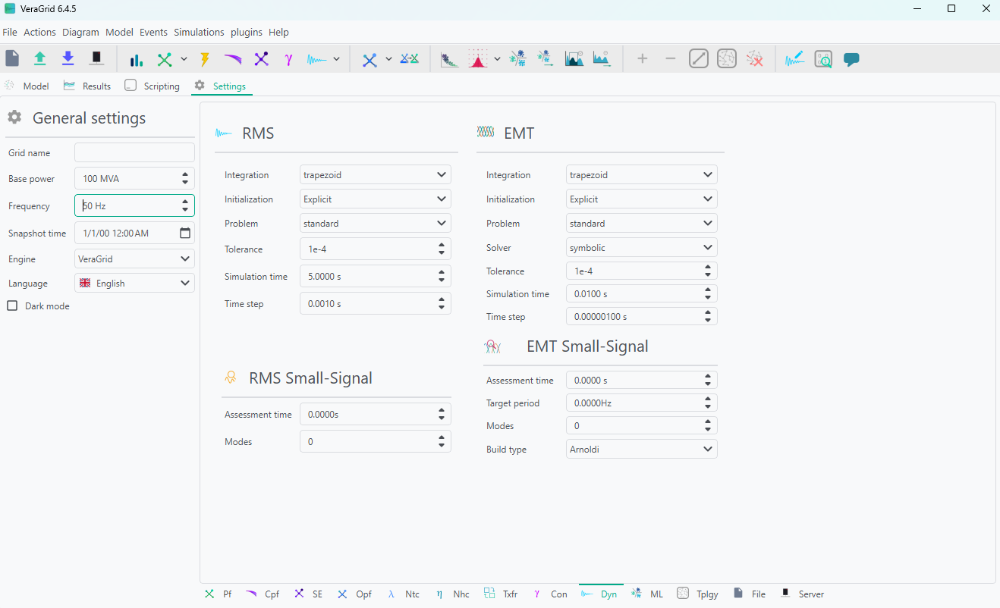
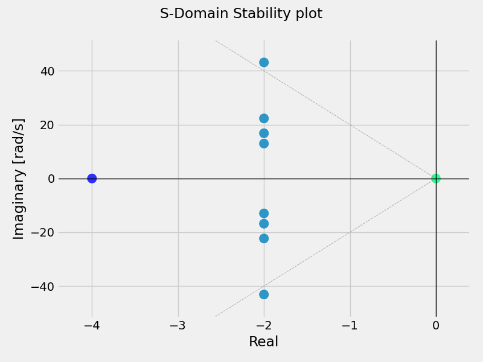
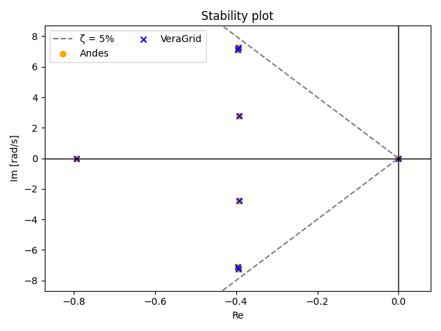

# 🔍 Small-Signal Stability Analysis

RMS Small-Signal stability analysis linearizes the RMS dynamic model around one operating point and computes the corresponding eigenvalues and modal information.

Before running the RMS Small-Signal assessment, a power-flow solution must exist because the RMS model is initialized from that operating point.

## RMS Workflow

The RMS Small-Signal driver follows two stages.

1. Build and initialize the RMS DAE model from the grid and the power-flow results.
2. Evaluate the linearization at the requested assessment time.

If `ss_assessment_time == 0.0`, the linearization is computed directly at the initialized RMS operating point.

If `ss_assessment_time > 0.0`, the driver first runs an RMS simulation from `t = 0` up to the requested assessment instant, and then linearizes the model at that dynamic state.

## Settings

This is the Small-Signal settings page:



### Small-Signal settings

- **Assessment time (s)**: Time instant where the linearization is evaluated.
- **Modes**: Number of eigenvalues to compute.

The `Modes` option selects the numerical path used by the driver.

- If `k = 0`, all available modes are computed with the dense algorithm.
- If `k >= n - 1`, where `n = number of states + number of differential variables`, the driver also falls back to the dense algorithm.
- If `0 < k < n - 1`, the sparse algorithm is used and returns only `k` modes.

### RMS settings used by the assessment

When `ss_assessment_time > 0.0`, the RMS simulation settings become part of the workflow because the system must first be simulated to the target instant.

- **Integration method**: RMS time-domain integrator used before linearization.
  - `DynamicIntegrationMethod.DaeBackEuler`
- **Time step (s)**: RMS integration step used to reach the assessment time.
- **Maximum iterations**: Nonlinear iterations allowed inside each implicit RMS step.
- **Initialization method**: RMS initialization strategy used to build the operating point before the simulation starts.
  - For example: `RmsInitializationMethod.PseudoTransient`
  - Or: `RmsInitializationMethod.Explicit`
- **Simulation time**: Must be consistent with the requested assessment time when the RMS simulation is used.
- **Verbose**: Controls the amount of printed diagnostic information.

The Small-Signal driver currently advances the pre-assessment RMS simulation with the RMS integration method selected in `RmsOptions` and then evaluates the Jacobians at the requested time.

## Numerical Formulation

The RMS Small-Signal implementation supports two related formulations.

### Standard formulation

When the RMS model has no differential-variable block in the generalized sense, the driver builds the classical reduced state matrix

$$
A = fx - fy \, gy^{-1} \, gx
$$

from the DAE Jacobians.

The eigenanalysis is then the standard problem

$$
A v = \lambda v
$$

In this case:

- the state matrix stored in the results is the reduced state matrix
- participation factors are computed from the left and right eigenvectors of `A`
- the participation-factor rows usually align with the RMS state variables

### Generalized formulation

When the RMS model includes differential variables that must be retained explicitly, the driver solves the generalized eigenvalue problem

$$
A v = \lambda E v
$$

using the matrices returned by `problem.get_static_state_matrix(x, dx)` and `problem.get_E_matrix(x, dx)`.

In this case:

- the state matrix stored in the results corresponds to the unreduced generalized linearization matrix used for the eigenanalysis
- participation factors are computed with the generalized normalization

$$
w_i^T E v_i = 1
$$
- the participation-factor rows and state-matrix axes can include both state and algebraic variables

This is why the results object also stores:

- `stat_vars_array`
- `algebraic_vars_array`

Those arrays identify how the result tables must be labelled in standard and generalized cases.

## Dense vs Sparse Calculation

The RMS driver exposes two eigensolution paths.

### Dense calculation

Dense calculation is used when all modes are requested.

- It computes the complete eigenvalue spectrum.
- It is the path used when `k = 0`.
- It is also used when `k` is large enough that sparse extraction is no longer meaningful.
- For the standard formulation it solves the full eigenproblem of the reduced matrix.
- For the generalized formulation it solves the dense generalized eigenproblem.

Dense calculation is the correct choice when:

- the full modal spectrum is required
- a complete participation-factor matrix is needed
- the model is small or medium enough that a full solve is affordable

### Sparse calculation

Sparse calculation is used when only a subset of modes is requested.

- It computes only `k` eigenvalues.
- It is used when `0 < k < n - 1`.
- It relies on sparse linear algebra and shift-and-invert style operators.
- It is the preferred path for large RMS models when only the dominant modes are needed.

Sparse calculation is the correct choice when:

- the model is large
- only a limited number of electromechanical or critical modes are required
- full-spectrum dense analysis would be unnecessarily expensive

## Results

The RMS Small-Signal study provides four result tables.

- **Modes**: Modal properties and the source table for the S-domain plot.
- **Participation factors**: Normalized participation-factor matrix. Row `k`, column `i` gives the participation of variable `k` in mode `i`.
- **State matrix**: Linearized state or generalized system matrix used by the modal analysis.
- **Right eigenvectors**: Right eigenvector matrix and the source table for the mode-shape plots.

### Modes and the S-domain plot

The **Modes** result replaces the former separate **S-Domain Plot** and **S-Domain Plot in Hz** entries. It contains one row per eigenvalue and the following columns.

| Column | Description |
|--------|-------------|
| `Real` | Real part of the eigenvalue. |
| `Imaginary [rad/s]` | Signed imaginary part in radians per second. |
| `Imaginary [Hz]` | Signed imaginary part divided by $2\pi$. Both members of a conjugate pair are retained. |
| `Damping ratio` | Damping ratio reported by the modal calculation. |
| `Oscillation frequency` | Frequency in hertz assigned only to the representative member of an oscillatory conjugate pair. Other rows contain `NaN`. |

Clicking **Plot** with no selection draws all visible modes in the complex plane using `Real` and `Imaginary [rad/s]`. The plot includes the $\zeta=5\%$ damping boundary, and hovering over a point shows its mode name and coordinates.

To plot a subset of modes, select cells or complete rows in the **Modes** table before clicking **Plot**. A filter applied to the table also limits the visible modes. When there is no selection, every mode that remains visible after filtering is plotted.

To use hertz on the imaginary axis:

1. Hold `Ctrl` and select the complete `Real` and `Imaginary [Hz]` column headers.
2. Optionally select the desired modal rows while keeping both complete columns selected.
3. Click **Plot**.

Only a complete pair consisting of `Real` and one of the two `Imaginary` columns changes the plot coordinates. Selecting ordinary cells chooses modes; it does not redefine the coordinate pair.



### Right eigenvectors and mode-shape plots

The **Right eigenvectors** table contains state variables in its rows and modes in its columns. Oscillatory representative modes include their frequency on a second line in the column header, for example `Mode 4` followed by `f=0.443 Hz`.

Clicking **Plot** draws each selected mode in a separate real-versus-imaginary subplot. Each state component is represented by an arrow from the origin. The vectors are phase-aligned with their dominant visible component and normalized so that this component has unit magnitude; this preserves the relative magnitude and phase of the other components.

Modes can be chosen by selecting their column headers or any cells in their columns. The column-name filter can also be used to reduce the table before plotting; for example, `col like Hz` keeps the oscillatory representative modes whose headers include a frequency. Select complete row headers to restrict the plotted state components. If there is no selection, all visible modes and state rows are plotted.

Complex-plane plotting is available for the original **Modes** and **Right eigenvectors** representations. Table transformations such as transpose, absolute value, or cumulative distribution produce a generic transformed table and therefore use the standard series plot.

### Result interpretation notes

- `damping_ratios` and `conjugate_frequencies` are reported for the representative member of each oscillatory conjugate pair.
- The other member of the conjugate pair and non-oscillatory modes keep `NaN` entries in those vectors.
- `Imaginary [Hz]` is different from `Oscillation frequency`: the former is a signed coordinate available for every eigenvalue, while the latter identifies one representative per oscillatory pair.
- In generalized RMS cases, result tables can include algebraic variables in addition to state variables.

<!-- BEGIN RESULTS REGISTERED PROPERTIES -->

## Registered Result Properties

### `SmallSignalStabilityRmsResults` registered properties

The RMS Small-Signal stability result stores modal, matrix, and labeling data for the current linearization.

| Property | Type | Description |
|----------|------|-------------|
| `stat_vars_array` | `StrVec` | Labels of the RMS state variables used to annotate result tables. |
| `algebraic_vars_array` | `StrVec` | Labels of the RMS algebraic variables used when generalized results include algebraic rows or columns. |
| `eigenvalues` | `Vec` | Eigenvalues of the linearized RMS system. |
| `participation_factors` | `Mat` | Normalized participation-factor matrix relating variables to modes. |
| `damping_ratios` | `Vec` | Damping ratio assigned to the representative member of each oscillatory conjugate pair. Other entries remain `NaN`. |
| `conjugate_frequencies` | `Vec` | Frequency in hertz assigned to the representative member of each oscillatory conjugate pair. Other entries remain `NaN`. |
| `state_matrix` | `Mat` | Linearized matrix used by the RMS modal analysis. |
| `right_eigenvectors` | `Mat` | Right eigenvector matrix associated with the computed modes. |

### `SmallSignalStabilityEmtResults` registered properties

The EMT Small-Signal stability result stores multiplier, eigenvalue, and participation-factor data.

| Property | Type | Description |
|----------|------|-------------|
| `multipliers` | `CxVec` | Discrete-time multipliers from the EMT Small-Signal analysis. |
| `eigenvalues` | `CxVec` | Eigenvalues of the linearized system. |
| `participation_factors` | `Mat` | Participation-factor matrix relating states or variables to modes. |

### `EraMatrixPencilResults` registered properties

The ERA matrix pencil result stores modal estimates and reconstruction diagnostics.

| Property | Type | Description |
|----------|------|-------------|
| `eigenvalues_s` | `CxVec` | Estimated continuous-time eigenvalues in the s-domain. |
| `frequencies_hz` | `Vec` | Mode frequencies in hertz. |
| `damping_ratios` | `Vec` | Damping ratio for each identified mode. |
| `is_stable` | `BoolVec` | Stability flag for each identified mode. |
| `residues` | `CxMat` | Modal residues estimated by the ERA matrix pencil method. |
| `modal_energy` | `Vec` | Estimated energy contribution of each mode. |
| `reconstruction_errors` | `Vec` | Signal reconstruction error for each selected model order. |
| `band_low_hz` | `Vec` | Lower frequency bound used for modal selection. |
| `band_high_hz` | `Vec` | Upper frequency bound used for modal selection. |
| `selected_orders` | `IntVec` | Model orders selected by the ERA matrix pencil analysis. |
| `observable_count_per_mode` | `IntVec` | Number of observed signals contributing to each mode. |

### `RmsResults` registered properties

The RMS result stores the simulated variable values.

| Property | Type | Description |
|----------|------|-------------|
| `values` | `Vec` | Simulated values matrix for the registered dynamic variables. |

### `EmtResults` registered properties

The EMT result stores the simulated variable values.

| Property | Type | Description |
|----------|------|-------------|
| `values` | `Vec` | Simulated values matrix for the registered dynamic variables. |
<!-- END RESULTS REGISTERED PROPERTIES -->

## API

The maintained RMS Small-Signal example is `trunk/dynamics/small_signal/rms_kundur_small_signal.py`. The pattern below follows the current driver usage.

```python
from pathlib import Path

import numpy as np

import VeraGridEngine.api as gce
from VeraGridEngine.enumerations import (
    DynamicIntegrationMethod,
    RmsInitializationMethod,
    VarPowerFlowReferenceType
)
from VeraGridEngine.Simulations.PowerFlow.power_flow_driver import (
    PowerFlowDriver,
    PowerFlowOptions,
)
from VeraGridEngine.Simulations.Rms.rms_options import RmsOptions
from VeraGridEngine.Simulations.SmallSignalStabilityRms.small_signal_driver import (
    SmallSignalStabilityRmsDriver,
)
from VeraGridEngine.Simulations.SmallSignalStabilityRms.small_signal_options import (
    RmsSmallSignalStabilityOptions,
)

from VeraGridEngine.Templates.Rms.genrow1_rms_template import get_genrow1_rms_template
from VeraGridEngine.Templates.Rms.genrow2_rms_template import get_genrow2_rms_template
from VeraGridEngine.Templates.Rms.genrow3_rms_template import get_genrow3_rms_template
from VeraGridEngine.Templates.Rms.genrow4_rms_template import get_genrow4_rms_template

from VeraGridEngine.Templates.Rms.line_rms_template import get_line_rms_template
from VeraGridEngine.Utils.Symbolic.bus_rms_template import initialize_bus_rms
from VeraGridEngine.Templates.Rms.load_rms_template import get_load_rms_template

# this example creates the KUNDUR grid without shunts. If you want to open an already created file use the following:
# grid_path = Path("..") / "Grids_and_profiles" / "grids" / "IEEE39_1W.veragrid"
# grid = gce.open_file(str(grid_path))


grid = gce.MultiCircuit()

# Buses
bus1 = gce.Bus(name="Bus1", Vnom=20)
bus2 = gce.Bus(name="Bus2", Vnom=20)
bus3 = gce.Bus(name="Bus3", Vnom=20, is_slack=True)
bus4 = gce.Bus(name="Bus4", Vnom=20)
bus5 = gce.Bus(name="Bus5", Vnom=230)
bus6 = gce.Bus(name="Bus6", Vnom=230)
bus7 = gce.Bus(name="Bus7", Vnom=230)
bus8 = gce.Bus(name="Bus8", Vnom=230)
bus9 = gce.Bus(name="Bus9", Vnom=230)
bus10 = gce.Bus(name="Bus10", Vnom=230)
bus11 = gce.Bus(name="Bus11", Vnom=230)

grid.add_bus(bus1)
grid.add_bus(bus2)
grid.add_bus(bus3)
grid.add_bus(bus4)
grid.add_bus(bus5)
grid.add_bus(bus6)
grid.add_bus(bus7)
grid.add_bus(bus8)
grid.add_bus(bus9)
grid.add_bus(bus10)
grid.add_bus(bus11)

for bus in grid.buses:
    initialize_bus_rms(bus, vf=grid.var_factory)

# Line

line0 = gce.Line(name="line 5-6-1", bus_from=bus5, bus_to=bus6,
                 r=0.00500, x=0.05000, b=0.02187, rate=750.0)

line1 = gce.Line(name="line 5-6-2", bus_from=bus5, bus_to=bus6,
                 r=0.00500, x=0.05000, b=0.02187, rate=750.0)

line2 = gce.Line(name="line 6-7-1", bus_from=bus6, bus_to=bus7,
                 r=0.00300, x=0.03000, b=0.00583, rate=700.0)

line3 = gce.Line(name="line 6-7-2", bus_from=bus6, bus_to=bus7,
                 r=0.00300, x=0.03000, b=0.00583, rate=700.0)

line4 = gce.Line(name="line 6-7-3", bus_from=bus6, bus_to=bus7,
                 r=0.00300, x=0.03000, b=0.00583, rate=700.0)

line5 = gce.Line(name="line 7-8-1", bus_from=bus7, bus_to=bus8,
                 r=0.01100, x=0.11000, b=0.19250, rate=400.0)

line6 = gce.Line(name="line 7-8-2", bus_from=bus7, bus_to=bus8,
                 r=0.01100, x=0.11000, b=0.19250, rate=400.0)

line7 = gce.Line(name="line 8-9-1", bus_from=bus8, bus_to=bus9,
                 r=0.01100, x=0.11000, b=0.19250, rate=400.0)

line8 = gce.Line(name="line 8-9-2", bus_from=bus8, bus_to=bus9,
                 r=0.01100, x=0.11000, b=0.19250, rate=400.0)

line9 = gce.Line(name="line 9-10-1", bus_from=bus9, bus_to=bus10,
                 r=0.00300, x=0.03000, b=0.00583, rate=700.0)

line10 = gce.Line(name="line 9-10-2", bus_from=bus9, bus_to=bus10,
                  r=0.00300, x=0.03000, b=0.00583, rate=700.0)

line11 = gce.Line(name="line 9-10-3", bus_from=bus9, bus_to=bus10,
                  r=0.00300, x=0.03000, b=0.00583, rate=700.0)

line12 = gce.Line(name="line 10-11-1", bus_from=bus10, bus_to=bus11,
                  r=0.00500, x=0.05000, b=0.02187, rate=750.0)

line13 = gce.Line(name="line 10-11-2", bus_from=bus10, bus_to=bus11,
                  r=0.00500, x=0.05000, b=0.02187, rate=750.0)

# Transformers
xt1 = 0.15 * (100.0 / 900.0)
trafo_G1 = gce.Line(name="trafo 5-1", bus_from=bus5, bus_to=bus1,
                r=0.00000, x=0.15 * (100.0 / 900.0), b=0.0, rate=900.0)

trafo_G2 = gce.Line(name="trafo 6-2", bus_from=bus6, bus_to=bus2,
                    r=0.00000, x=0.15 * (100.0 / 900.0), b=0.0, rate=900.0)

trafo_G3 = gce.Line(name="trafo 11-3", bus_from=bus11, bus_to=bus3,
                    r=0.00000, x=0.15 * (100.0 / 900.0), b=0.0, rate=900.0)

trafo_G4 = gce.Line(name="trafo 10-4", bus_from=bus10, bus_to=bus4,
                    r=0.00000, x=0.15 * (100.0 / 900.0), b=0.0, rate=900.0)

# load
load1 = gce.Load(name="load1", P=967.0, Q=100.0)

load2 = gce.Load(name="load2", P=1767.0, Q=100.0)

# Generators
fn_1 = 60.0
M_1 = 13.0 * 9.0
D_1 = 10.0 * 9.0
ra_1 = 0.0
xd_1 = 0.3 * 100.0 / 900.0
omega_ref_1 = 1.0
Kp_1 = 0.0
Ki_1 = 0.0

fn_2 = 60.0
M_2 = 13.0 * 9.0
D_2 = 10.0 * 9.0
ra_2 = 0.0
xd_2 = 0.3 * 100.0 / 900.0
omega_ref_2 = 1.0
Kp_2 = 0.0
Ki_2 = 0.0

fn_3 = 60.0
M_3 = 12.35 * 9.0
D_3 = 10.0 * 9.0
ra_3 = 0.0
xd_3 = 0.3 * 100.0 / 900.0
omega_ref_3 = 1.0
Kp_3 = 0.0
Ki_3 = 0.0

fn_4 = 60.0
M_4 = 12.35 * 9.0
D_4 = 10.0 * 9.0
ra_4 = 0.0
xd_4 = 0.3 * 100.0 / 900.0
omega_ref_4 = 1.0
Kp_4 = 0.0
Ki_4 = 0.0

# Generators
gen1 = gce.Generator(
    name="Gen1", P=700.0, vset=1.03, Snom=900.0,
    x1=xd_1, r1=ra_1, freq=fn_1,
)

gen2 = gce.Generator(
    name="Gen2", P=700.0, vset=1.01, Snom=900.0,
    x1=xd_2, r1=ra_2, freq=fn_2,
)

gen3 = gce.Generator(
    name="Gen3", P=719.091, vset=1.03, Snom=900.0,
    x1=xd_3, r1=ra_3, freq=fn_3,
)

gen4 = gce.Generator(
    name="Gen4", P=700.0, vset=1.01, Snom=900.0,
    x1=xd_4, r1=ra_4, freq=fn_4,
)

######################################################################################################
# Build Rms models
######################################################################################################

# Build rms models from template
# generators
genrow_mdl1 = get_genrow1_rms_template(grid.var_factory).block
genrow_mdl2 = get_genrow2_rms_template(grid.var_factory).block
genrow_mdl3 = get_genrow3_rms_template(grid.var_factory).block
genrow_mdl4 = get_genrow4_rms_template(grid.var_factory).block

# lines
line0_mdl = get_line_rms_template(grid.var_factory).block
line1_mdl = get_line_rms_template(grid.var_factory).block
line2_mdl = get_line_rms_template(grid.var_factory).block
line3_mdl = get_line_rms_template(grid.var_factory).block
line4_mdl = get_line_rms_template(grid.var_factory).block
line5_mdl = get_line_rms_template(grid.var_factory).block
line6_mdl = get_line_rms_template(grid.var_factory).block
line7_mdl = get_line_rms_template(grid.var_factory).block
line8_mdl = get_line_rms_template(grid.var_factory).block
line9_mdl = get_line_rms_template(grid.var_factory).block
line10_mdl = get_line_rms_template(grid.var_factory).block
line11_mdl = get_line_rms_template(grid.var_factory).block
line12_mdl = get_line_rms_template(grid.var_factory).block
line13_mdl = get_line_rms_template(grid.var_factory).block

# trafos
trafo1_mdl = get_line_rms_template(grid.var_factory).block
trafo2_mdl = get_line_rms_template(grid.var_factory).block
trafo3_mdl = get_line_rms_template(grid.var_factory).block
trafo4_mdl = get_line_rms_template(grid.var_factory).block

# loads
load1_mdl = get_load_rms_template(grid.var_factory).block
load2_mdl = get_load_rms_template(grid.var_factory).block

# set models parameters
load1_mdl.set_parameter_in_model(var_name="Pl0", new_value=-9.670000000007317)
load1_mdl.set_parameter_in_model(var_name="Ql0", new_value=-0.9999999999967969)

load2_mdl.set_parameter_in_model(var_name="Pl0", new_value=-17.6699999999199)
load2_mdl.set_parameter_in_model(var_name="Ql0", new_value=-0.999999999989467)

# connection with buses

grid.var_factory.add_connections([genrow_mdl1.in_vars[0]], [bus1.rms_model.out_vars[0]])
grid.var_factory.add_connections([genrow_mdl1.in_vars[1]], [bus1.rms_model.out_vars[1]])

grid.var_factory.add_connections([genrow_mdl2.in_vars[0]], [bus2.rms_model.out_vars[0]])
grid.var_factory.add_connections([genrow_mdl2.in_vars[1]], [bus2.rms_model.out_vars[1]])

grid.var_factory.add_connections([genrow_mdl3.in_vars[0]], [bus3.rms_model.out_vars[0]])
grid.var_factory.add_connections([genrow_mdl3.in_vars[1]], [bus3.rms_model.out_vars[1]])

grid.var_factory.add_connections([genrow_mdl4.in_vars[0]], [bus4.rms_model.out_vars[0]])
grid.var_factory.add_connections([genrow_mdl4.in_vars[1]], [bus4.rms_model.out_vars[1]])

grid.var_factory.add_connections([line0_mdl.in_vars[0]], [bus5.rms_model.out_vars[0]])
grid.var_factory.add_connections([line0_mdl.in_vars[1]], [bus5.rms_model.out_vars[1]])

grid.var_factory.add_connections([line0_mdl.in_vars[2]], [bus6.rms_model.out_vars[0]])
grid.var_factory.add_connections([line0_mdl.in_vars[3]], [bus6.rms_model.out_vars[1]])

grid.var_factory.add_connections([line1_mdl.in_vars[0]], [bus5.rms_model.out_vars[0]])
grid.var_factory.add_connections([line1_mdl.in_vars[1]], [bus5.rms_model.out_vars[1]])

grid.var_factory.add_connections([line1_mdl.in_vars[2]], [bus6.rms_model.out_vars[0]])
grid.var_factory.add_connections([line1_mdl.in_vars[3]], [bus6.rms_model.out_vars[1]])

grid.var_factory.add_connections([line2_mdl.in_vars[0]], [bus6.rms_model.out_vars[0]])
grid.var_factory.add_connections([line2_mdl.in_vars[1]], [bus6.rms_model.out_vars[1]])

grid.var_factory.add_connections([line2_mdl.in_vars[2]], [bus7.rms_model.out_vars[0]])
grid.var_factory.add_connections([line2_mdl.in_vars[3]], [bus7.rms_model.out_vars[1]])

grid.var_factory.add_connections([line3_mdl.in_vars[0]], [bus6.rms_model.out_vars[0]])
grid.var_factory.add_connections([line3_mdl.in_vars[1]], [bus6.rms_model.out_vars[1]])

grid.var_factory.add_connections([line3_mdl.in_vars[2]], [bus7.rms_model.out_vars[0]])
grid.var_factory.add_connections([line3_mdl.in_vars[3]], [bus7.rms_model.out_vars[1]])

grid.var_factory.add_connections([line4_mdl.in_vars[0]], [bus6.rms_model.out_vars[0]])
grid.var_factory.add_connections([line4_mdl.in_vars[1]], [bus6.rms_model.out_vars[1]])

grid.var_factory.add_connections([line4_mdl.in_vars[2]], [bus7.rms_model.out_vars[0]])
grid.var_factory.add_connections([line4_mdl.in_vars[3]], [bus7.rms_model.out_vars[1]])

grid.var_factory.add_connections([line5_mdl.in_vars[0]], [bus7.rms_model.out_vars[0]])
grid.var_factory.add_connections([line5_mdl.in_vars[1]], [bus7.rms_model.out_vars[1]])

grid.var_factory.add_connections([line5_mdl.in_vars[2]], [bus8.rms_model.out_vars[0]])
grid.var_factory.add_connections([line5_mdl.in_vars[3]], [bus8.rms_model.out_vars[1]])

grid.var_factory.add_connections([line6_mdl.in_vars[0]], [bus7.rms_model.out_vars[0]])
grid.var_factory.add_connections([line6_mdl.in_vars[1]], [bus7.rms_model.out_vars[1]])

grid.var_factory.add_connections([line6_mdl.in_vars[2]], [bus8.rms_model.out_vars[0]])
grid.var_factory.add_connections([line6_mdl.in_vars[3]], [bus8.rms_model.out_vars[1]])

grid.var_factory.add_connections([line7_mdl.in_vars[0]], [bus8.rms_model.out_vars[0]])
grid.var_factory.add_connections([line7_mdl.in_vars[1]], [bus8.rms_model.out_vars[1]])

grid.var_factory.add_connections([line7_mdl.in_vars[2]], [bus9.rms_model.out_vars[0]])
grid.var_factory.add_connections([line7_mdl.in_vars[3]], [bus9.rms_model.out_vars[1]])

grid.var_factory.add_connections([line8_mdl.in_vars[0]], [bus8.rms_model.out_vars[0]])
grid.var_factory.add_connections([line8_mdl.in_vars[1]], [bus8.rms_model.out_vars[1]])

grid.var_factory.add_connections([line8_mdl.in_vars[2]], [bus9.rms_model.out_vars[0]])
grid.var_factory.add_connections([line8_mdl.in_vars[3]], [bus9.rms_model.out_vars[1]])

grid.var_factory.add_connections([line9_mdl.in_vars[0]], [bus9.rms_model.out_vars[0]])
grid.var_factory.add_connections([line9_mdl.in_vars[1]], [bus9.rms_model.out_vars[1]])

grid.var_factory.add_connections([line9_mdl.in_vars[2]], [bus10.rms_model.out_vars[0]])
grid.var_factory.add_connections([line9_mdl.in_vars[3]], [bus10.rms_model.out_vars[1]])

grid.var_factory.add_connections([line10_mdl.in_vars[0]], [bus9.rms_model.out_vars[0]])
grid.var_factory.add_connections([line10_mdl.in_vars[1]], [bus9.rms_model.out_vars[1]])

grid.var_factory.add_connections([line10_mdl.in_vars[2]], [bus10.rms_model.out_vars[0]])
grid.var_factory.add_connections([line10_mdl.in_vars[3]], [bus10.rms_model.out_vars[1]])

grid.var_factory.add_connections([line11_mdl.in_vars[0]], [bus9.rms_model.out_vars[0]])
grid.var_factory.add_connections([line11_mdl.in_vars[1]], [bus9.rms_model.out_vars[1]])

grid.var_factory.add_connections([line11_mdl.in_vars[2]], [bus10.rms_model.out_vars[0]])
grid.var_factory.add_connections([line11_mdl.in_vars[3]], [bus10.rms_model.out_vars[1]])

grid.var_factory.add_connections([line12_mdl.in_vars[0]], [bus10.rms_model.out_vars[0]])
grid.var_factory.add_connections([line12_mdl.in_vars[1]], [bus10.rms_model.out_vars[1]])

grid.var_factory.add_connections([line12_mdl.in_vars[2]], [bus11.rms_model.out_vars[0]])
grid.var_factory.add_connections([line12_mdl.in_vars[3]], [bus11.rms_model.out_vars[1]])

grid.var_factory.add_connections([line13_mdl.in_vars[0]], [bus10.rms_model.out_vars[0]])
grid.var_factory.add_connections([line13_mdl.in_vars[1]], [bus10.rms_model.out_vars[1]])

grid.var_factory.add_connections([line13_mdl.in_vars[2]], [bus11.rms_model.out_vars[0]])
grid.var_factory.add_connections([line13_mdl.in_vars[3]], [bus11.rms_model.out_vars[1]])

grid.var_factory.add_connections([trafo1_mdl.in_vars[0]], [bus5.rms_model.out_vars[0]])
grid.var_factory.add_connections([trafo1_mdl.in_vars[1]], [bus5.rms_model.out_vars[1]])

grid.var_factory.add_connections([trafo1_mdl.in_vars[2]], [bus1.rms_model.out_vars[0]])
grid.var_factory.add_connections([trafo1_mdl.in_vars[3]], [bus1.rms_model.out_vars[1]])

grid.var_factory.add_connections([trafo2_mdl.in_vars[0]], [bus6.rms_model.out_vars[0]])
grid.var_factory.add_connections([trafo2_mdl.in_vars[1]], [bus6.rms_model.out_vars[1]])

grid.var_factory.add_connections([trafo2_mdl.in_vars[2]], [bus2.rms_model.out_vars[0]])
grid.var_factory.add_connections([trafo2_mdl.in_vars[3]], [bus2.rms_model.out_vars[1]])

grid.var_factory.add_connections([trafo3_mdl.in_vars[0]], [bus11.rms_model.out_vars[0]])
grid.var_factory.add_connections([trafo3_mdl.in_vars[1]], [bus11.rms_model.out_vars[1]])

grid.var_factory.add_connections([trafo3_mdl.in_vars[2]], [bus3.rms_model.out_vars[0]])
grid.var_factory.add_connections([trafo3_mdl.in_vars[3]], [bus3.rms_model.out_vars[1]])

grid.var_factory.add_connections([trafo4_mdl.in_vars[0]], [bus10.rms_model.out_vars[0]])
grid.var_factory.add_connections([trafo4_mdl.in_vars[1]], [bus10.rms_model.out_vars[1]])

grid.var_factory.add_connections([trafo4_mdl.in_vars[2]], [bus4.rms_model.out_vars[0]])
grid.var_factory.add_connections([trafo4_mdl.in_vars[3]], [bus4.rms_model.out_vars[1]])

grid.var_factory.add_connections([load1_mdl.in_vars[0]], [bus7.rms_model.out_vars[0]])
grid.var_factory.add_connections([load1_mdl.in_vars[1]], [bus7.rms_model.out_vars[1]])

grid.var_factory.add_connections([load2_mdl.in_vars[0]], [bus9.rms_model.out_vars[0]])
grid.var_factory.add_connections([load2_mdl.in_vars[1]], [bus9.rms_model.out_vars[1]])

# external mapping

big_gen1 = gce.Block(children=[genrow_mdl1])
big_gen2 = gce.Block(children=[genrow_mdl2])
big_gen3 = gce.Block(children=[genrow_mdl3])
big_gen4 = gce.Block(children=[genrow_mdl4])

big_gen1.external_mapping.update({VarPowerFlowReferenceType.P: genrow_mdl1.out_vars[0]})
big_gen1.external_mapping.update({VarPowerFlowReferenceType.Q: genrow_mdl1.out_vars[1]})

big_gen2.external_mapping.update({VarPowerFlowReferenceType.P: genrow_mdl2.out_vars[0]})
big_gen2.external_mapping.update({VarPowerFlowReferenceType.Q: genrow_mdl2.out_vars[1]})

big_gen3.external_mapping.update({VarPowerFlowReferenceType.P: genrow_mdl3.out_vars[0]})
big_gen3.external_mapping.update({VarPowerFlowReferenceType.Q: genrow_mdl3.out_vars[1]})

big_gen4.external_mapping.update({VarPowerFlowReferenceType.P: genrow_mdl4.out_vars[0]})
big_gen4.external_mapping.update({VarPowerFlowReferenceType.Q: genrow_mdl4.out_vars[1]})

# add models to opi objects

gen1.rms_model = big_gen1
gen2.rms_model = big_gen2
gen3.rms_model = big_gen3
gen4.rms_model = big_gen4

line0.rms_model = line0_mdl
line1.rms_model = line1_mdl
line2.rms_model = line2_mdl
line3.rms_model = line3_mdl
line4.rms_model = line4_mdl
line5.rms_model = line5_mdl
line6.rms_model = line6_mdl
line7.rms_model = line7_mdl
line8.rms_model = line8_mdl
line9.rms_model = line9_mdl
line10.rms_model = line10_mdl
line11.rms_model = line11_mdl
line12.rms_model = line12_mdl
line13.rms_model = line13_mdl

trafo_G1.rms_model = trafo1_mdl
trafo_G2.rms_model = trafo2_mdl
trafo_G3.rms_model = trafo3_mdl
trafo_G4.rms_model = trafo4_mdl

load1.rms_model = load1_mdl
load2.rms_model = load2_mdl

grid.add_line(line0)
grid.add_line(line1)
grid.add_line(line2)
grid.add_line(line3)
grid.add_line(line4)
grid.add_line(line5)
grid.add_line(line6)
grid.add_line(line7)
grid.add_line(line8)
grid.add_line(line9)
grid.add_line(line10)
grid.add_line(line11)
grid.add_line(line12)
grid.add_line(line13)

grid.add_line(trafo_G1)
grid.add_line(trafo_G2)
grid.add_line(trafo_G3)
grid.add_line(trafo_G4)

grid.add_load(bus=bus7, api_obj=load1)
grid.add_load(bus=bus9, api_obj=load2)

grid.add_generator(bus=bus1, api_obj=gen1)
grid.add_generator(bus=bus2, api_obj=gen2)
grid.add_generator(bus=bus3, api_obj=gen3)
grid.add_generator(bus=bus4, api_obj=gen4)

######################################################################################################
# Run PowerFlow and Small-Signal stability
######################################################################################################

# The RMS Small-Signal assessment always starts from one solved power flow.
pf_options = PowerFlowOptions(
        solver_type=gce.SolverType.NR,
        retry_with_other_methods=False,
        verbose=0,
        initialize_with_existing_solution=True,
        tolerance=1e-6,
        max_iter=25,
        control_q=False,
        control_taps_modules=True,
        control_taps_phase=True,
        control_remote_voltage=True,
        orthogonalize_controls=True,
        apply_temperature_correction=True,
        branch_impedance_tolerance_mode=gce.BranchImpedanceMode.Specified,
        distributed_slack=False,
        ignore_single_node_islands=False,
        trust_radius=1.0,
        backtracking_parameter=0.05,
        use_stored_guess=False,
        initialize_angles=False,
        generate_report=False,
    )
power_flow = PowerFlowDriver(grid=grid, options=pf_options)
power_flow.run()
pf_results = power_flow.results

# RMS options are only used when the assessment time is strictly positive,
# because the driver must simulate the RMS model up to that instant before
# building the linearization.
rms_options = RmsOptions(time_step=0.001,
                         simulation_time=10,
                         tolerance=1e-6,
                         integration_method=DynamicIntegrationMethod.DaeBackEuler,
                         initialization_method=RmsInitializationMethod.Explicit,
                         use_init_values=False,
                         max_iter=1000,
                         verbose=0)


# k = 0 requests the complete eigenvalue spectrum.
sss_options = RmsSmallSignalStabilityOptions(k=0,
                                             ss_assessment_time=0,
                                             verbose=1)


driver = SmallSignalStabilityRmsDriver(grid=grid,
                                       rms_options=rms_options,
                                       sss_options=sss_options,
                                       pf_results=pf_results,
                                       )
driver.run()

results = driver.results

eigenvalues = np.asarray(results.eigenvalues, dtype=complex)
participation = np.asarray(results.participation_factors, dtype=float)
damping_ratios = np.asarray(results.damping_ratios, dtype=float)
frequencies_hz = np.asarray(results.conjugate_frequencies, dtype=float)
state_matrix = np.asarray(results.state_matrix)
right_eigenvectors = np.asarray(results.right_eigenvectors, dtype=complex)
state_labels = np.asarray(results.stat_vars_array, dtype=str)
algebraic_labels = np.asarray(results.algebraic_vars_array, dtype=str)
```

### Assessment at a nonzero time

To linearize the system at a later instant, keep the same workflow and change the assessment time.

```python
sss_options = RmsSmallSignalStabilityOptions(
    k=20,
    ss_assessment_time=5.0,
    verbose=1,
)
```

In that case, the driver first runs the RMS simulation to `t = 5.0 s` and then computes the modal analysis there.

## Benchmark

### Running ANDES

Thanks to its symbolic precision and reliable numerical performance, ANDES provides a great baseline for stability analysis in contemporary power system studies. That's why VeraGrid uses ANDES as its benchmark for Small-Signal analysis. Of course, VeraGrid successfully reproduces all eigenvalue placements from ANDES.

VeraGrid loads ANDES models by opening json files. Naturally, VeraGrid replicates all eigenvalue results from ANDES across standard benchmarks like the Kundur two area system with consistent accuracy and sub-second performance.

This is the code to get ANDES results:

```python
"""
To run this script andes must be installed (pip install andes)
"""
import andes
import time
import pandas as pd
import numpy as np

def stability_andes():

   ss = andes.load('Gen_Load/kundur_ieee_no_shunt.json', default_config=True)
   n_xy = len(ss.dae.xy_name)
   print(f"Andes variables = {n_xy}")
   ss.files.no_output = True

   # fix P & Q load ANDES
   ss.PQ.config.p2p = 1.0
   ss.PQ.config.p2i = 0
   ss.PQ.config.p2z = 0

   ss.PQ.config.q2q = 1.0
   ss.PQ.config.q2i = 0
   ss.PQ.config.q2z = 0

   dae = ss.dae

   # Run PF
   ss.PFlow.config.tol = 1e-8
   ss.PFlow.run()

   #Run Small-Signal Stability analysis
   eig = ss.EIG
   eig.run()

   df_Eig = pd.DataFrame(eig.mu)
   df_Eig.to_csv("Eigenvalues_results_Andes.csv", index=False, header=False)

   df_pfactors = pd.DataFrame(eig.pfactors.T)
   df_pfactors.to_csv("pfactors_results_Andes.csv", index=False, header=False, float_format="%.10f")

    return eig.mu, eig.pfactors
```

Comparing the case of Kundur two-area system VeraGrid gets exactly the same results.



The following plot template is used to compare results.

```python
import matplotlib.pyplot as plt
import numpy as np

x1 = VeraGrid_Eig.real
y1 = VeraGrid_Eig.imag
x2= Andes_Eig.real
y2 = Andes_Eig.imag
slope = 1 / 0.05
x_z = np.linspace(-200, 0, 400)
y_z = slope * x_z
# Plot the two lines (positive and negative imaginary axis)
plt.plot(x_z, y_z, '--', color='grey', label='$\lambda$ = 5%')
plt.plot(x_z, -y_z, '--', color='grey')
plt.scatter(x2, y2, marker='o', color='orange', label='Andes')
plt.scatter(x1, y1, marker='x', color='blue', label='VeraGrid')
plt.xlabel("Re [s -1]")
plt.ylabel("Im [s -1]")
plt.title("Stability plot")
margin_x = (x1.max() - x1.min()) * 0.1
margin_y = (y1.max() - y1.min()) * 0.1
x_min = x1.min() - margin_x
x_max = x1.max() + margin_x
y_min = y1.min() - margin_y
y_max = y1.max() + margin_y
plt.xlim([x_min, x_max])
plt.ylim([y_min, y_max])
plt.axhline(0, color='black', linewidth=1)
plt.axvline(0, color='black', linewidth=1)
plt.legend(loc='upper left', ncol=2)
plt.tight_layout()
plt.show()
```

Where `VeraGrid_Eig` and `Andes_Eig` are numpy arrays with the eigenvalues results from the VeraGrid and Andes stability assessments respectively.
