# 📊 User interface

The user interface of VeraGrid is written using the Qt graphical interface
framework. This allows VeraGrid to be multi-platform and to have sufficient
performance to handle thousands of graphical items in the editor and to be
responsive when working with large data sets.

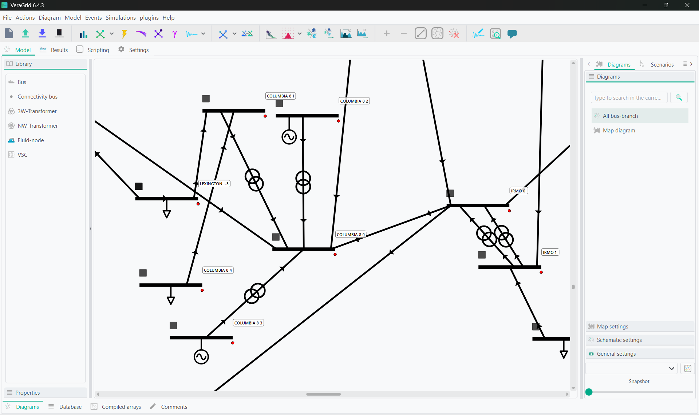    
    VeraGrid user interface representing  a zoom of a ~500 node grid.

The interface automatically detects your system language when available. If your system language is not available, the program defaults to English. You can change the language directly from the GUI. VeraGrid is currently available in:
- English
- Mandarin Chinese
- Cantonese
- Japanese
- Korean
- Hindi
- Arabic
- Greek
- Spanish
- Portuguese
- French
- German
- Italian
- Dutch

If you would like to contribute to adding your language, feel free to get in touch.

The graphical user interface (GUI) makes extensive use of tooltip texts. These are tags that appear
when you hover the mouse cursor over a button from the interface. The tooltip texts are meant to be explanatory
so that reading a manual is not required unless you need the technical details.

Nevertheless, this guide hopes to guide you through the GUI well enough so that the program is usable.

## Diagram View

The diagram view is where all the editing is done. It is divided into three different panels. 

### Library and parameters

In the left panel, you can find the library of elements to drag and drop into your schematics. By then clicking on an element in the schematic and switching to the properties tab, you will be able to observe and edit a specific element's parameters. These properties can be filtered to include only the parameters relevant to the simulation you're conducting.

### Schematic and map editors

In the main panel, you can find the schematics and map diagrams that represent the system currently under study. You can create as many maps and schematics, either of the whole system or of specific portions, as you want. Creating these smaller schematics will allow you to focus on results for specific areas, while still simulating the full system. 

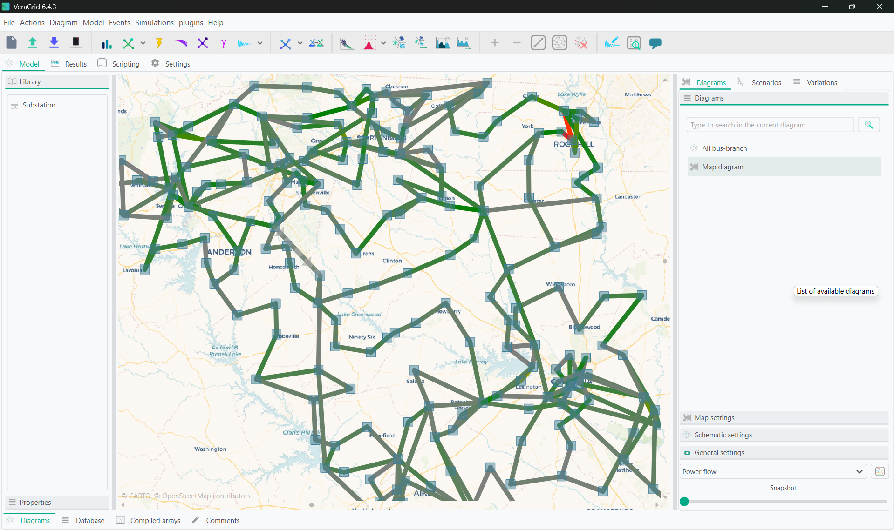    
    Sample map diagram of ~500 node grid.

### Diagram Settings, Scenarios and Variations

In the right plane, there are three more tabs you can use. 

In the diagrams tab, you can create new maps or diagrams and also edit settings for the map and schematic diagrams, using either preset templates or customized sizes, set the algorithm for automatic schematic layouts, and set the plotting style for the results visible in the diagram and results tab. 

In the scenarios tab, you can create different variations of you grid using scenarios, and easily merge changes from different working branches. 

In the variations tab, you will find results from studies with many different possible outcomes, such as the investment optimization, from this you will be able to select specific outputs of the simulation to investigate deeper. 

### Working in the model view 

The usage of the model view is quite simple:

- Drag & Drop the buses from the left panel into the main panel.
- Click on a bus bar (black line) and drag the link into another bus bar, a branch will be created.

  - Branch types can be selected (branch, transformer, line, switch, reactance).
  - If you double-click a branch that is a line of transformer, a simplified editor will pop up.

- To add loads, generators, shunts, etc... just right click on  bus and select from the context menu.
  
  - If you double-click on a generator or load, a simplified editor will pop up.

- The context menu from the buses allow plenty of operations such as view the bus profiles (if timeseries are present) or setting a bus as a short circuit point. This can be accessed by right clicking on the bus.

The schematic objects are coloured based on the results of the latest simulation. For buses and branches, the most relevant simulation results are also shown. 

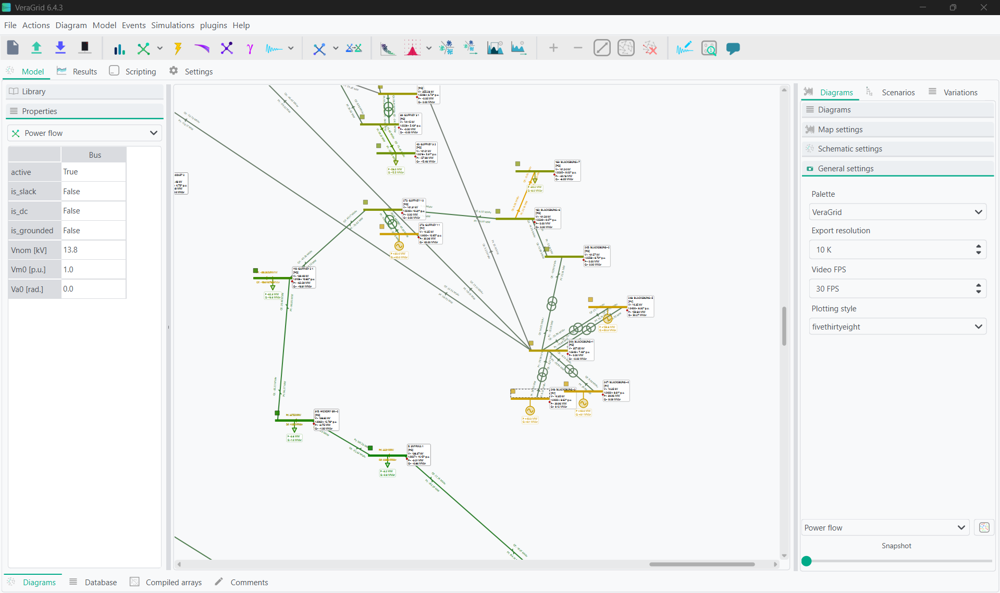

When multiple simulation results are available, use the controls at the bottom of the right panel in the Diagram tab to select which simulation is displayed on the schematic. For simulations with a time component, such as time series, use the slider below the results selector to navigate to a specific time step. You can also right-click on buses or branches to observe the full simulation profiles.

## Tabular database editor

Sometimes is far more practical to edit the objects in bulk. For that, VeraGrid features the tabular view
of the objects. All the static properties of the objects can be edited here. The database is divided into three editors. 
- The objects editor allows you to edit parameters in the snapshot case and parameters that do not have timeseries associations. When you edit any parameter here for a value that has an associated timeseries, you will be prompted to decide whether to apply this change to the full timeseries as well.
- The associations editor allows you to edit associations of the grid elements. This includes the owner of that element, and technology, fuel, and emissions associations for generators and loads.
- The timeseries editor allows you to visualize, create and manipulate the profiles of the various magnitudes of the program.

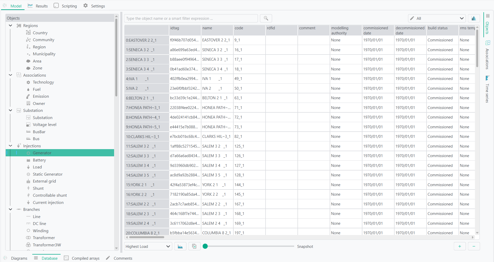

### Object Categories

The object tree on the left side of the database editor organizes the model objects by purpose. Expand a category and select an object type to display all objects of that type in the table.

Each row represents one object and each column represents one of its properties. The available columns depend on the selected object type and on the property-category filter applied above the table.

You can the VeraGrid default catalogues for RMS, EMT, FMU, and device templates under Actions -> Add default catalogue

### Branch templates

Templates are available for different branch types. The templates are designed to ease the process of defining the
properties of the branch objects.

- *Wires*: A wire is not strictly a branch, but it is required to be able to define an overhead line.
- *Tower*: It is a composition of wires bundled by phase (A:1, B:2, C:3, Neutral:0) that represents a tower. 
The overhead lines can be further edited using the Line builder (see below)
- *Underground lines*: Underground lines are defined with the zero sequence and positive sequence parameters.
- *Sequence lines*: Generic sequence lines are defined with the zero sequence and positive sequence parameters.
- *Transformers*: The three-phase transformers are defined with the short circuit study parameters.

Visit the theory section to learn more about these models.

The overhead line editor allows you to define an overhead line in any way you want, bundling many wires per phase if you
need and including the neutral. The equations for this functionality are taken from the EMTP theory book.

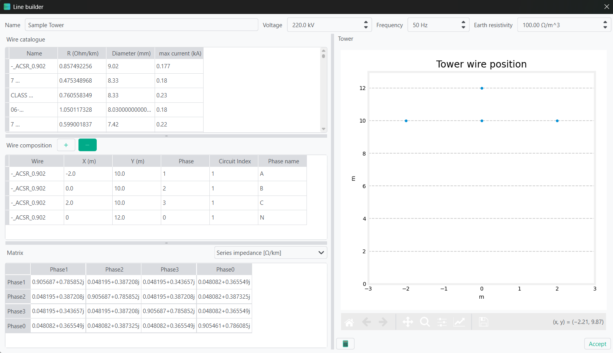

### Timeseries loading

The time series is what makes VeraGrid what it is. To handle time series efficiently by design is what made me
design this program.

Timeseries values can be inputted in many ways, including with scripting. Within the database tab, there are a few options to do this using wizards.

From the time series tab you can access the time series importer. This is a program to read excel and csv files from which
to import the profiles. Each column of the imported file is treated as an individual profile.
The imported profiles can be normalized and scaled. Each profile can be assigned in a number of ways to the objects for
which the profiles are being imported.

Linking methods:

- Automatically based on the profile name and the object's names.
- Random links between profiles and objects; Each object is assigned with a random profile.
- Assign the selected profile to all objects.
- Assign the selected profile to the selected objects.

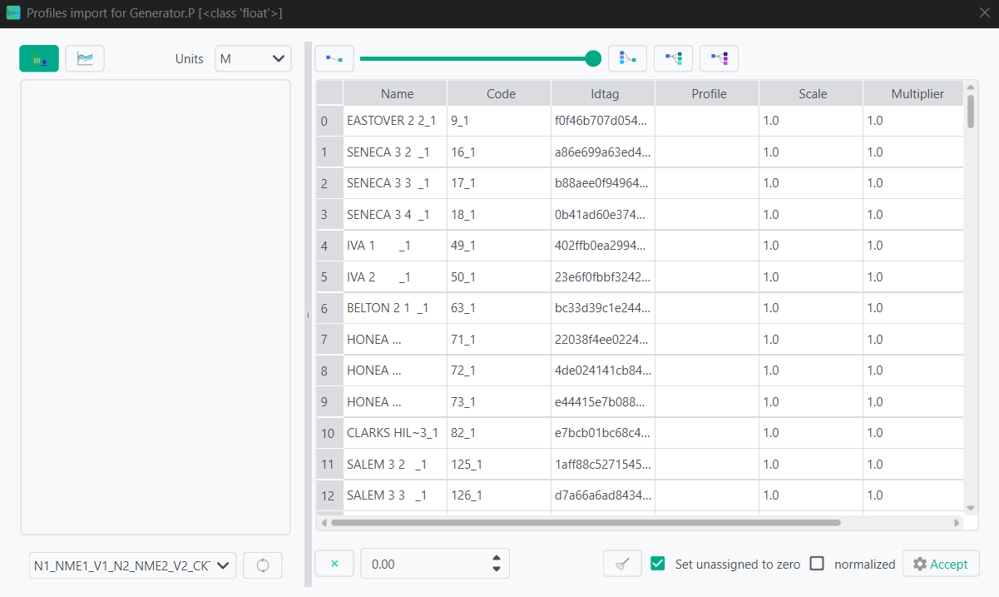

The second option is to import from various snapshot models. To complete this, first load a single model. Once completed, you can then load all remaining models in order using the blue button beside the previous mentioned, and the profiles will be completed by reading the model data. 

The final option is to copy and paste the profiles to the associated generators and loads from another tabular editor. This is less recommended as it can cause conflicts in input type.

### Search queries

The database and the results tab contain search boxes to perform advanced searches.

Here we explain how to compose a search query.

Queries in VeraGrid are made by using the following synthax:

```
    [subject] [operation] [value] [and/or] [subject] [operation] [value] [and/or] ...
```

Observe that this query is composed by smaller sub-queries that are joined by the *and* / *or* operations

Each subquery is composed as:

```
    [subject] [operation] [value]
```

The subject is what to compare. Possible subjects:

- val: Value
- col: column value
- idx: Index value
- colobj: Object underlying
- idxobj: Object underlying

The operation is how to compare. Possible operations:

- <: less than the value
- <= less or equal than the value
- &gt;: Greater than the value
- &gt;=: Greater than or equal to the value
- "=": Equal than the value
- "!=": Different than the value
- "like": The value is in the subject
- "notlike": The value is not in the subject
- "starts": The subject starts with the value
- "ends": The subject ends with the value

Finally, the value is what to compare to. The value can be a single entity
or a list of values provided between brackets [val1, val2, ...]

## Compiled Arrays

In this tab you can see the underlying arrays for the computations VeraGrid is completing. To show them, click the calculator icon. 

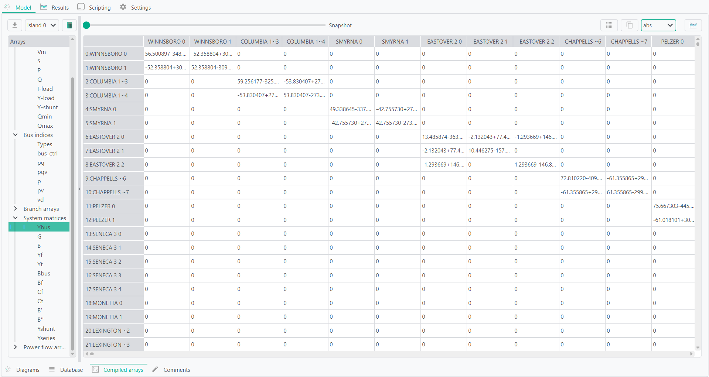

This tab can be useful when investigating grids to find topological islands that need to be resolved.

## Results

The Results tab provides a common interface for reviewing the outputs of all simulations performed during the current session. Results are organized by study in the tree on the left. Expanding a study displays the result categories available for that simulation.

Selecting a result displays its data in the appropriate results view. The information shown in the grid diagrams can therefore also be inspected numerically, plotted, copied, filtered, and exported.

### Snapshot and time-series results

The tabular results view is used for snapshot simulations and simulations containing multiple time steps. Each row and column corresponds to a result dimension, such as a bus, branch, device, contingency, area, or point in time. The units of the selected result are displayed next to the table.

The available results depend on the simulation.

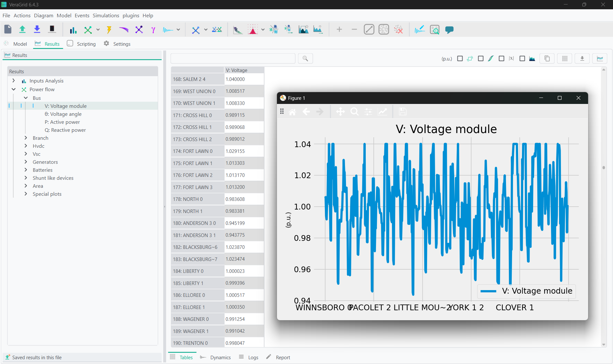

The table includes several tools for inspecting and processing the results:

- Transpose exchanges the rows and columns of the table.
- Absolute converts the displayed values to their absolute values.
- CDF converts the values into a cumulative distribution representation.
- Search filters the table using an expression.
- Stacked plot displays compatible result series as a stacked chart.
- Copy places the displayed table on the clipboard so that it can be pasted into spreadsheet software.
- Copy as NumPy places a NumPy representation of the data on the clipboard for use in Python.
- Save exports the displayed table to CSV or Excel format.

For time-series simulations, timestamps or time indices form one of the table dimensions. This makes it possible to inspect the evolution of grid quantities over the simulation period and plot selected devices or variables against time.

The result tree may contain several completed simulations at the same time, although only one of the same study (ex: power flow) at the same time. Selecting a different study changes the active table, logs, and report. A simulation and its stored results can also be removed through the context menu of the result tree.

### Dynamic results

The dynamic results view is used for RMS and EMT simulations. Dynamic variables are organized by device type, device, model, and variable, allowing individual states, measurements, control signals, and parameters to be located within large dynamic models.

Use the search field to filter the dynamic object tree. Double-clicking an available result variable plots it directly.

For more structured analysis, variables can be organized into plot groups:

1. Create a plot group.
2. Drag variables from the dynamic object tree into the group.
3. Select the group or one of its variables.
4. Display the corresponding plot or inspect its numerical values in the table.

Plot groups and variables can be renamed to produce clearer figure labels. Individual variables or complete groups can also be removed. A plot group can contain variables from different devices, making it possible to compare quantities such as voltages, frequencies, currents, power outputs, controller states, and protection signals in the same figure.

Where a simulation contains several event groups, the selected series remains associated with its corresponding event group. This distinguishes results that have the same variable name but originate from different simulated events.

Dynamic plot definitions are stored with the circuit. RMS and EMT plot groups can therefore be prepared before running a simulation and reused when the study is repeated. This is useful when the same set of signals must be reviewed across different model parameters, events, or operating conditions.

Selecting a plot entry also displays its underlying values in tabular form, providing access to the numerical data used to generate the figure.

### Logs

The Logs view displays the messages produced by the selected simulation. Entries are organized by severity and context and may include:

- Information about the simulation process.
- Convergence messages.
- Model or data warnings.
- Devices affected by a particular issue.
- Numerical errors and failed checks.
- Additional information generated while compiling or solving the network.

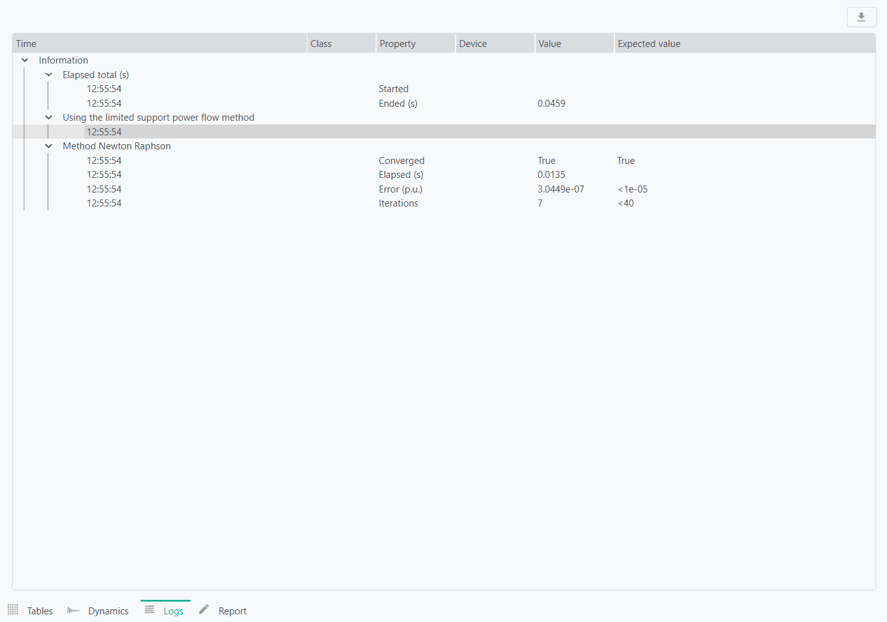

Logs are particularly useful when a simulation does not converge, produces incomplete results, or requires changes to the grid model. Selecting another study loads the logs associated with that specific simulation.

The complete log can be exported to CSV or Excel for further review, issue tracking, or inclusion in validation records.

### Report

The Report view displays the textual report generated by the selected simulation. 

## Scripting

The Scripting tab provides an embedded Python environment for automating tasks directly within the graphical user interface. It includes a script editor for writing and saving reusable Python code and an interactive console for running individual commands and inspecting objects.

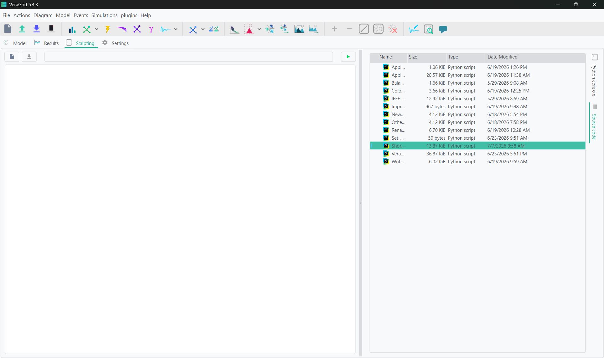

The active VeraGrid application is available through the `app` object. The grid currently open in the GUI can be accessed as:

```python
grid = app.circuit
```

`app.circuit` is a `MultiCircuit` object and provides access to the complete network model. Through it, scripts can complete any actions available in the GUI.

The simulation session is available through:

```python
session = app.session
```

The session manages simulation drivers and their results. It can be used to list the completed studies, retrieve a driver or results object, iterate through the available results, inspect simulation logs, register a driver, or run a simulation programmatically.

The GUI application itself exposes additional functionality through `app`. This includes simulation options, result tables, diagram tools, import and export functions, and many of the operations available from the menus and toolbars.

Diagrams stored in the grid are available through:

```python
diagrams = app.circuit.diagrams
```

This collection can contain schematic diagrams and map diagrams. Scripts can inspect their represented devices and stored locations, create new diagrams, add or remove diagram elements, process geographic coordinates, and automate the preparation of network views.

Since the console is a normal Python environment, standard Python operations and compatible installed packages can be used for numerical processing, plotting, data analysis, and file handling. VeraGrid Engine classes and simulation drivers can also be imported and used in the same way as in an external Python script.

Changes made directly to the underlying circuit are immediately applied to the in-memory model. Some graphical changes may require refreshing the relevant table, tree, diagram, or results view before they become visible in the interface. Saving the project stores supported changes in the VeraGrid file.

## Settings

The Settings tab contains the general grid configuration and the options associated with each simulation type.

### Base settings

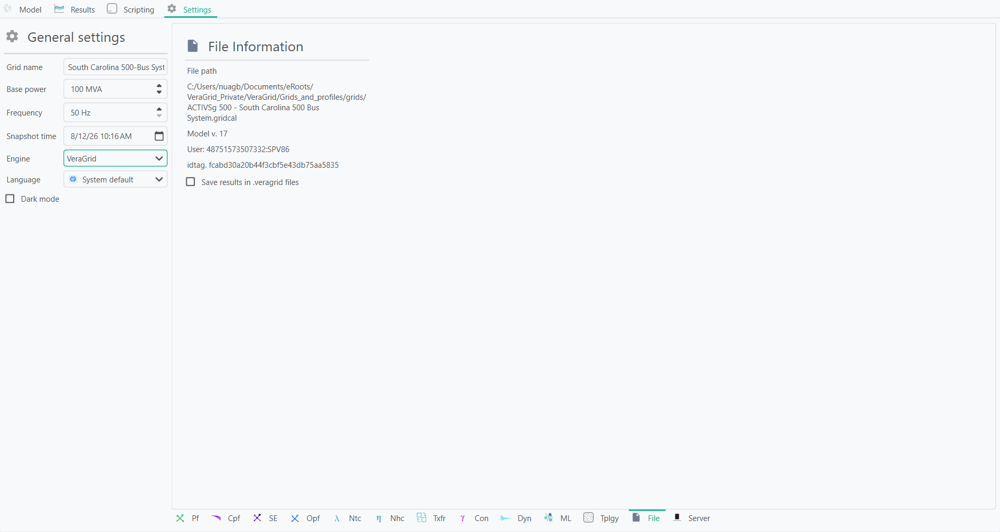

The base settings are:
- Grid name: Name used to identify the grid model.
- Base power: Power base of the grid in megavolt-amperes (MVA). VeraGrid uses the per-unit system, for which this value defines the base power. It is recommended not to change it.
- Base frequency: Nominal frequency of the grid in hertz (Hz).
- Time index of snapshot: Time-series index used to populate the snapshot values of the grid. Changing this index updates the snapshot to the values stored at the selected time step.
- Language: Language used by the graphical user interface. VeraGrid can automatically detect the system language, and the language can also be selected manually from the available translations.

### Saving results with the model

VeraGrid can save simulation results together with the grid model. When this option is enabled, the results remain available after closing and reopening the file. This is also useful when sharing a model with another user who needs to inspect the results.

Saving results can increase the size of the file, particularly for time-series and dynamic simulations.

### Simulation settings

Each simulation has its own settings, which control how the study is configured and executed. These settings are explained in detail in the documentation section dedicated to the corresponding simulation.

## Data analysis dashboard

The data analysis dashboard evaluates the quality and simulation readiness of the grid model. It combines structural checks, numerical conditioning, power-balance analysis, and the sigma stability margin into an overall grid health score.

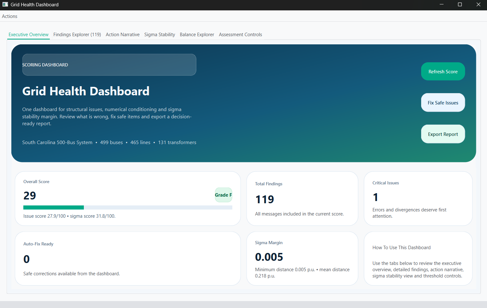

The dashboard includes:

- An executive overview with the overall score, critical issues, and available automatic fixes.
- A findings explorer that can be filtered by severity, object type, fixability, or search text.
- An action narrative summarizing the main problems and recommended next steps.
- A balance explorer for comparing active and reactive power balances by area, zone, country, or other available aggregations.
- A sigma stability view showing the distance of each bus from the sigma boundary.
- Assessment controls for adjusting diagnostic thresholds and deciding whether time-series profiles should also be analysed or corrected.

Supported issues can be corrected directly using Fix Safe Issues. After applying the changes, VeraGrid reruns the analysis and updates the score. The findings can be exported separately to Excel, while the complete dashboard report can be exported to Excel, HTML, or PDF.

## Comments editor

You can add comments to the grid file, for example when collaborating with other users or documenting modelling decisions, assumptions, data sources, and pending changes. These comments are saved with the grid and remain available when the file is reopened.


